# CasLearn OLMS Platform — Technical Design

**Status:** Proposed for S0 sign-off
**Target MVP release:** 2026-07-31
**Companion docs:** [`requirements.md`](./requirements.md), `.kiro/steering/{product,tech,structure,security,delivery,documentation}.md`

This document is the architectural contract for the MVP. Every section is traceable back to specific acceptance criteria in `requirements.md` (format: `Req X.Y`) and to the twelve correctness properties (`CP-1`..`CP-12`). Technology choices are fixed by `tech.md`; deviations require an ADR in `caslearn-docs/adr/`.

---

## 1. Architecture Overview

CasLearn OLMS is a microservices platform built around an Istio service mesh and delivered via GitOps. Seven backend Java services and one React SPA are packaged as Helm charts that deploy identically on-prem (primary) and on AWS EKS (option) — **the same chart, the same image digests, only the storage and ingress values differ** (Req 23).

**Security posture.** Authentication terminates at the Gateway: clients present OAuth 2.0 / JWT bearer tokens, and the Gateway validates signature, expiry, and issuer before forwarding (Req 1.3, Req 4.1, CP-11). Inside the mesh, `PeerAuthentication` forces `STRICT` mTLS (Req 5.1, Req 24.1) and per-service `AuthorizationPolicy` resources restrict which peer ServiceAccounts may call which backends (Req 24.2). A second enforcement layer runs inside each service in Spring Security, checking role **and** ownership — "this instructor owns this course", "this student has an active enrollment in this course" (Req 2.3). Requests containing a client-supplied `role` field in body, header, or query are rejected outright, whether or not the value matches the current user's role (Req 2.5, CP-3). If the RBAC subsystem is unavailable, services **fail closed** with HTTP 503 (Req 13.4).

**Contracts.** OpenAPI specs live in `caslearn-api-contracts`, versioned semver. The Gateway validates every request against the spec before it reaches a backend (Req 4.1, CP-12); backends re-validate with Bean Validation as defence in depth. TypeScript clients for `caslearn-web-ui` are generated from the contracts repo via `openapi-typescript-codegen`.

**Grounded AI.** The AI Service implements Retrieval-Augmented Generation. Before querying the vector store, it computes the caller's **authorized Content_Item set** by asking the Course Service which items the student may read, then filters the retrieval candidate set on that set (Req 17.4, CP-6). The LLM is never called from any other service (by convention and Istio egress policy), every prompt / retrieved chunk / response triple is persisted for audit (Req 17.2), and if no chunk scores above 0.2 similarity the service refuses to answer from general knowledge (Req 17.3).

**Tamper-evident audit log.** Every service owns its `audit_log` table. Each row stores a canonical payload plus `prev_hash` and `entry_hash`, where `entry_hash = SHA-256(canonical_payload || prev_hash)` (Req 3.3, CP-5). A nightly verifier job walks the chain and fires a `AuditChainBroken` alert on any mismatch. If an audit write actually fails (as opposed to being placed in maintenance mode), the triggering request is rejected with HTTP 500 and the `audit_log_write_failure_total` counter increments (Req 3.6).

**Portability.** Helm charts emit the **same resource kinds and counts** in on-prem and AWS modes (Req 23.4). A `pre-install` validation hook rejects mismatched values (Req 23.2, Req 23.3). On-prem uses MinIO + local-path PVs + Percona/MySQL Operator; AWS uses S3 + EBS + RDS multi-AZ. ArgoCD is the single GitOps engine in both.

**Observability is first-class.** Every service emits Prometheus metrics via Micrometer, structured JSON logs via Logback, and OTLP traces via Micrometer Tracing + Tempo (Req 25.1, Req 25.3, Req 25.4). One Grafana dashboard per service plus an `Admin Overview` dashboard (Req 8.2). No Datadog, no paid SaaS (Req 25.2).

---

## 2. C4 Diagrams

### 2.1 C4 Context

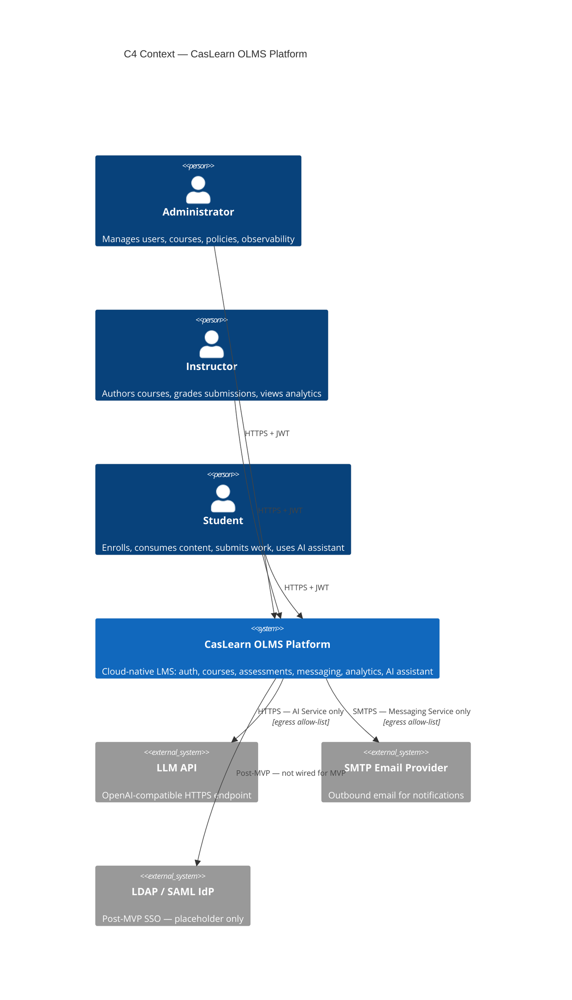

Validates Req 1, Req 2, Req 17, Req 30.1.

### 2.2 C4 Container

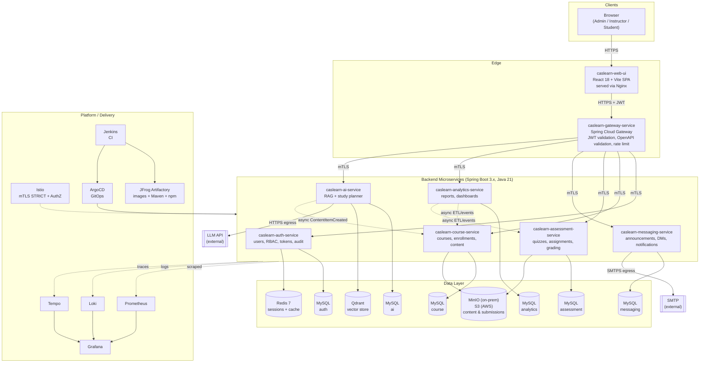

Validates Req 1, Req 2, Req 14.2, Req 22, Req 23, Req 24, Req 25.

### 2.3 C4 Component — Auth Service

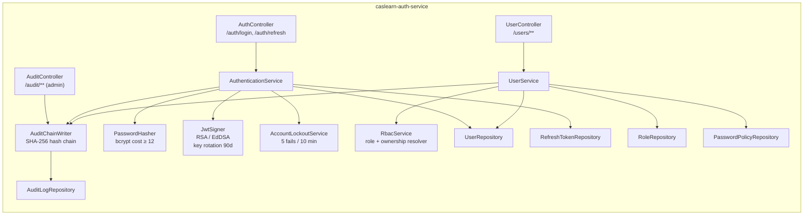

Validates Req 1, Req 2, Req 3, Req 6.

### 2.4 C4 Component — Assessment Service

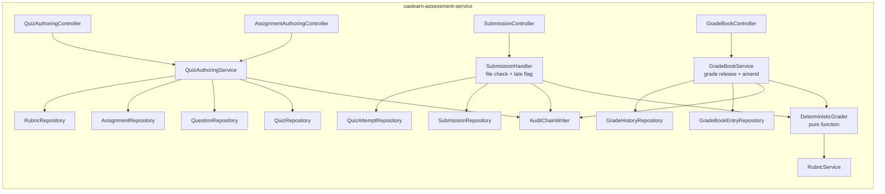

Validates Req 10, Req 11, Req 15, CP-4, CP-7.

### 2.5 C4 Component — AI Service

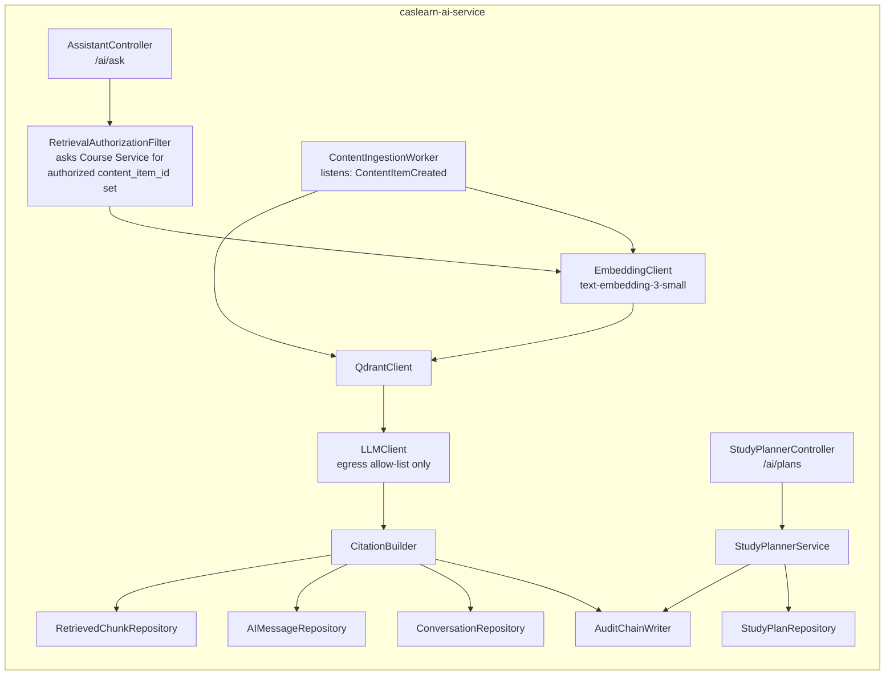

Validates Req 17, Req 18, CP-6.

---

## 3. Service Dependency Diagram

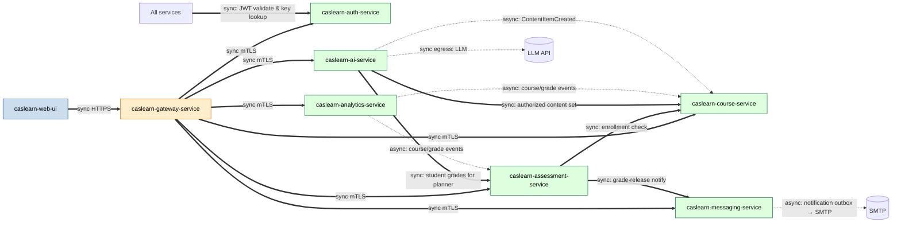

Heavy double-arrows are **synchronous request/response**; dashed arrows are **asynchronous events** over an in-process outbox + scheduled drainer (no external message broker in MVP — keeps S0 footprint small).

Validates Req 22, Req 24.

---

## 4. Data Flow Diagrams

### 4.1 Login → JWT

```mermaid
sequenceDiagram
    autonumber
    participant U as User Browser
    participant UI as caslearn-web-ui
    participant GW as Gateway
    participant AU as Auth Service
    participant DB as MySQL (auth)
    participant R as Redis

    U->>UI: submit login form
    UI->>GW: POST /auth/login {email, password}
    GW->>GW: validate against OpenAPI (Req 4.1)
    GW->>AU: POST /login (mTLS)
    AU->>DB: SELECT user by email
    AU->>AU: bcrypt.verify (cost ≥ 12)
    alt invalid credentials
        AU->>DB: INSERT audit_log(LOGIN_FAILED)
        AU->>AU: increment lockout counter
        AU-->>GW: 401 (opaque — does not reveal which field)
        GW-->>UI: 401
    else valid
        AU->>AU: sign JWT (role, sub, exp ≤ 60 min)
        AU->>R: store refresh token id
        AU->>DB: INSERT audit_log(LOGIN_SUCCESS, hash-chained)
        AU-->>GW: 200 {jwt, refresh}
        GW-->>UI: 200 {jwt, refresh}
        UI->>UI: store JWT in memory; refresh in httpOnly cookie
    end
```

Validates Req 1.1, Req 1.2, Req 1.7, Req 3.1, CP-11.

### 4.2 Student Opens Course — Enrollment Gate (CP-1)

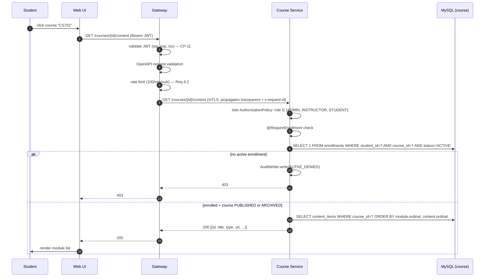

Validates Req 14.2, Req 14.3, CP-1.

### 4.3 AI Assistant Query — Retrieval Authorization (CP-6)

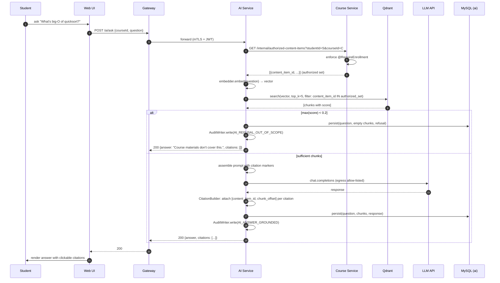

Validates Req 17.1, Req 17.2, Req 17.3, Req 17.4, CP-6.

---

## 5. Network & Security Topology

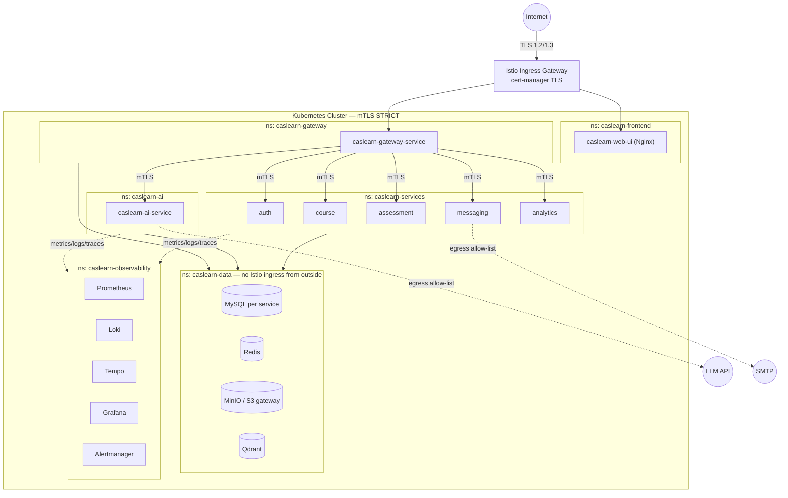

Key controls:

- `PeerAuthentication` `mtls.mode: STRICT` applied to every namespace that hosts a CasLearn service (Req 5.1, Req 24.1).
- Each service has its own `AuthorizationPolicy` that allows **only** the specific peer ServiceAccounts it expects (Gateway → services; Assessment → Course; AI → Course; AI → Assessment) (Req 24.2). Default stance is deny, so a missing rule = HTTP 403 (Req 24.3).
- Egress is controlled by an Istio `ServiceEntry` + `Sidecar` allow-list. Only `caslearn-ai-service` may reach the LLM host; only `caslearn-messaging-service` may reach the SMTP host (supports A10 SSRF mitigation from `security.md`).
- `caslearn-data` namespace has **no** Istio ingress gateway binding and no `AuthorizationPolicy` permitting traffic from outside the cluster. Cross-namespace traffic is allowed only from `caslearn-gateway`, `caslearn-services`, and `caslearn-ai`.
- Kubernetes NetworkPolicies reinforce the namespace boundaries for platforms where Istio's L7 policies aren't sufficient on their own.

Validates Req 5, Req 24.

---

## 6. Deployment Topology — On-Prem

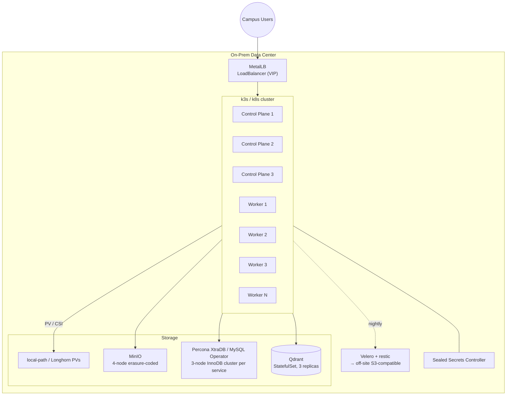

Key choices:

- 3 control-plane nodes for etcd quorum; N ≥ 4 workers sized for MVP load (see §18).
- MetalLB provides the VIP that the Istio ingress gateway binds to.
- Storage: local-path or Longhorn PVs; MinIO for object storage (Req 23.2).
- Percona / MySQL Operator for HA MySQL with per-service schemas.
- Sealed Secrets Controller replaces cloud KMS — secrets encrypted at rest in Git, decrypted only in-cluster (Req 5.3).
- Velero performs nightly snapshots of PVs and MinIO buckets to an off-site S3-compatible target.

Validates Req 23.2, Req 27.2 (data export infra).

---

## 7. Deployment Topology — AWS EKS

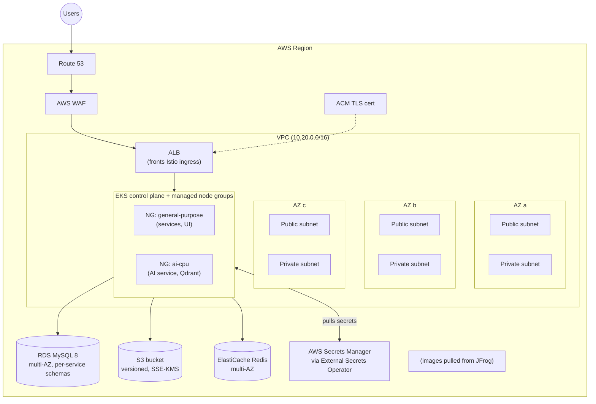

Key choices:

- 3 AZs; public subnets host ALBs, private subnets host EKS nodes (Req 23 portability — resource kinds match on-prem).
- Istio ingress gateway exposed via ALB; TLS cert from ACM; WAF in front.
- MySQL via RDS multi-AZ (per-service schemas — same logical layout as on-prem).
- S3 replaces MinIO; ElastiCache replaces in-cluster Redis.
- Secrets flow via External Secrets Operator reading AWS Secrets Manager; in-cluster resource is still a `Secret` so the chart is identical.
- Qdrant remains in-cluster on a dedicated node group (EBS gp3) rather than a managed vector service — keeps portability contract (Req 23.4).

Validates Req 23.3, Req 23.4.

---

## 8. CI/CD Pipeline

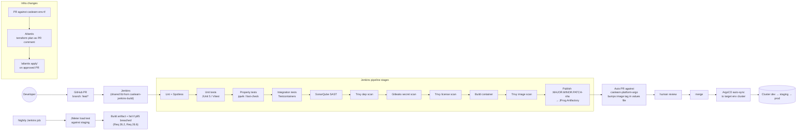

Guarantees enforced by this pipeline:

- Any PR failing SAST, dep scan, secret scan, license scan at severity HIGH or above is blocked from merge (Req 22.4, `security.md` CI gates).
- Image publication happens **only** after all scans pass (Req 22.4).
- GitOps invariant: cluster state = `caslearn-platform-argo` HEAD. No `kubectl apply` in prod (Req 22.3).
- Day-0 smoke test runs on every PR to `caslearn-platform-helm` and `caslearn-docs` and blocks merge (Req 20.6; override path in Req 20.7).
- Repo-name suffix check is its own stage, emitting a distinct failure reason so it cannot be masked by other failures (Req 19.4).

Validates Req 19, Req 20, Req 21, Req 22.

---

## 9. Data Model — Per-Service ERDs

No cross-service foreign keys. Referential integrity across services is enforced via service APIs and event contracts, not at the database layer (Req 23 portability, `tech.md` "per-service schema; no cross-service joins").

### 9.1 Auth Service

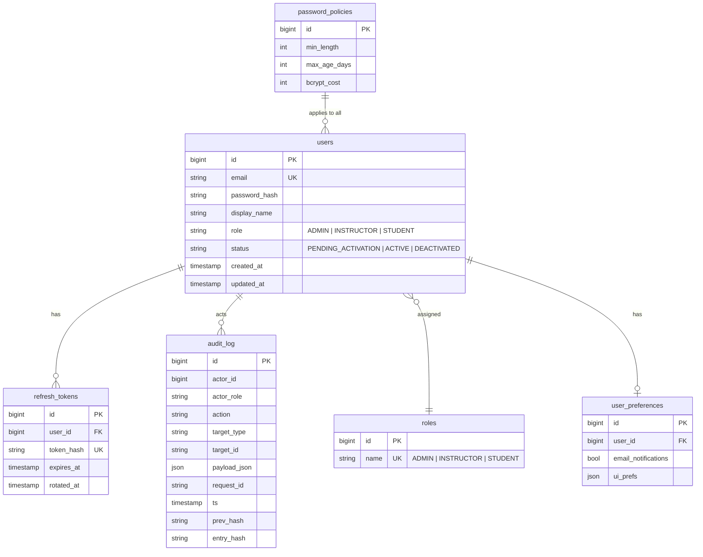

**Critical indexes:**
- `users(email)` unique — for login lookup (Req 1.1).
- `refresh_tokens(token_hash)` unique + `(user_id, expires_at)`.
- `audit_log(ts)` + `audit_log(actor_id, ts)` for export filtering (Req 8.4, Req 27.4).
- `audit_log(prev_hash, entry_hash)` for chain verifier scans (Req 3.3, CP-5).

Validates Req 1, Req 2, Req 3, Req 6, Req 8.1.

### 9.2 Course Service

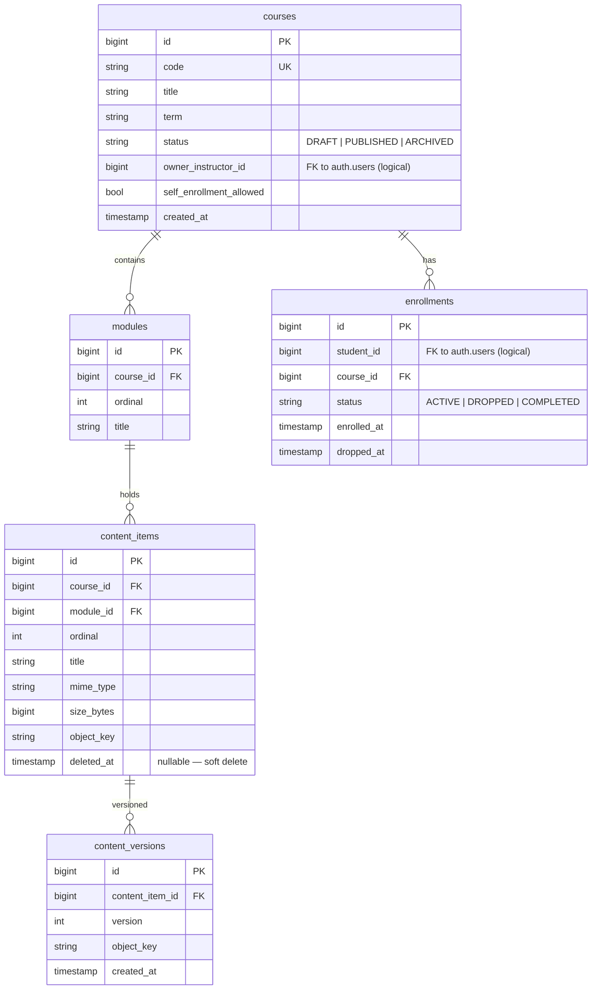

**Critical indexes:**
- `enrollments(student_id, course_id, status)` — powers CP-1's enrollment check on every content read.
- `enrollments(course_id, status)` — instructor roster and CP-8's count invariant.
- `courses(code)` unique, `courses(owner_instructor_id)`.
- `content_items(course_id, module_id, ordinal)` — ordered content read (Req 9.4, Req 14.2).
- `content_items(deleted_at)` partial index for soft-delete filtering (Req 9.5).

Validates Req 7, Req 9, Req 14, CP-1, CP-8.

### 9.3 Assessment Service

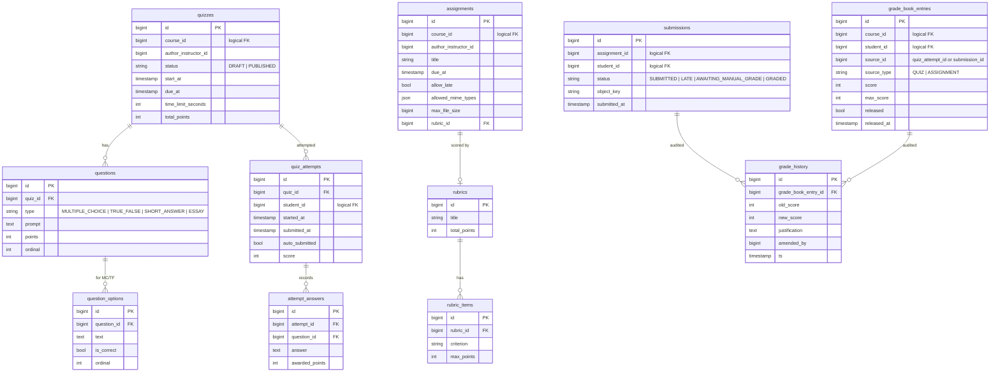

**Critical indexes:**
- `quizzes(course_id, status)`, `assignments(course_id, due_at)`.
- `submissions(student_id, assignment_id)` unique — one submission per student/assignment before amend.
- `quiz_attempts(student_id, quiz_id, started_at)`.
- `grade_book_entries(course_id, student_id)` — student self-view and instructor analytics (Req 15.5, CP-2).
- `grade_book_entries(released, released_at)` — notification worker (Req 11.5).

Validates Req 10, Req 11, Req 15, CP-2, CP-4, CP-7.

### 9.4 Messaging Service

```mermaid
erDiagram
    announcements ||--o{ message_recipients : "broadcasts"
    direct_messages ||--o{ message_recipients : "addresses"
    notification_preferences
    notification_outbox

    announcements {
        bigint id PK
        bigint course_id "logical FK"
        bigint author_id "logical FK"
        text subject
        text body
        timestamp posted_at
    }
    direct_messages {
        bigint id PK
        bigint sender_id "logical FK"
        text subject
        text body
        timestamp sent_at
    }
    message_recipients {
        bigint id PK
        string source_type "ANNOUNCEMENT | DM"
        bigint source_id
        bigint recipient_id "logical FK"
        bool read
        timestamp read_at
    }
    notification_preferences {
        bigint id PK
        bigint user_id "logical FK" UK
        bool email_enabled
    }
    notification_outbox {
        bigint id PK
        string channel "IN_APP | EMAIL"
        bigint recipient_id
        string subject
        text body
        string idempotency_key UK
        string status "PENDING | SENT | FAILED"
        timestamp scheduled_at
        timestamp sent_at
    }
```

**Critical indexes:**
- `message_recipients(recipient_id, read, source_type)` — unread inbox.
- `notification_outbox(status, scheduled_at)` — drainer query.
- `notification_outbox(idempotency_key)` unique — CP-9 enforcement.

Validates Req 12, Req 16, CP-9.

### 9.5 Analytics Service

Analytics is a **read model** fed by scheduled ETL jobs and (post-MVP) an event stream. MVP uses polled projections refreshed every 5 minutes to avoid a message broker.

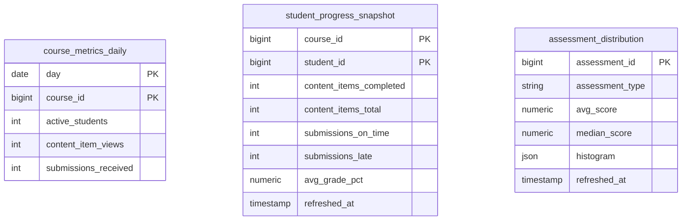

**Critical indexes:**
- `student_progress_snapshot(course_id, student_id)` composite PK — instructor course-roster read (Req 13.2).
- `course_metrics_daily(course_id, day)` — dashboard panels.

Validates Req 8.2, Req 13.

### 9.6 AI Service

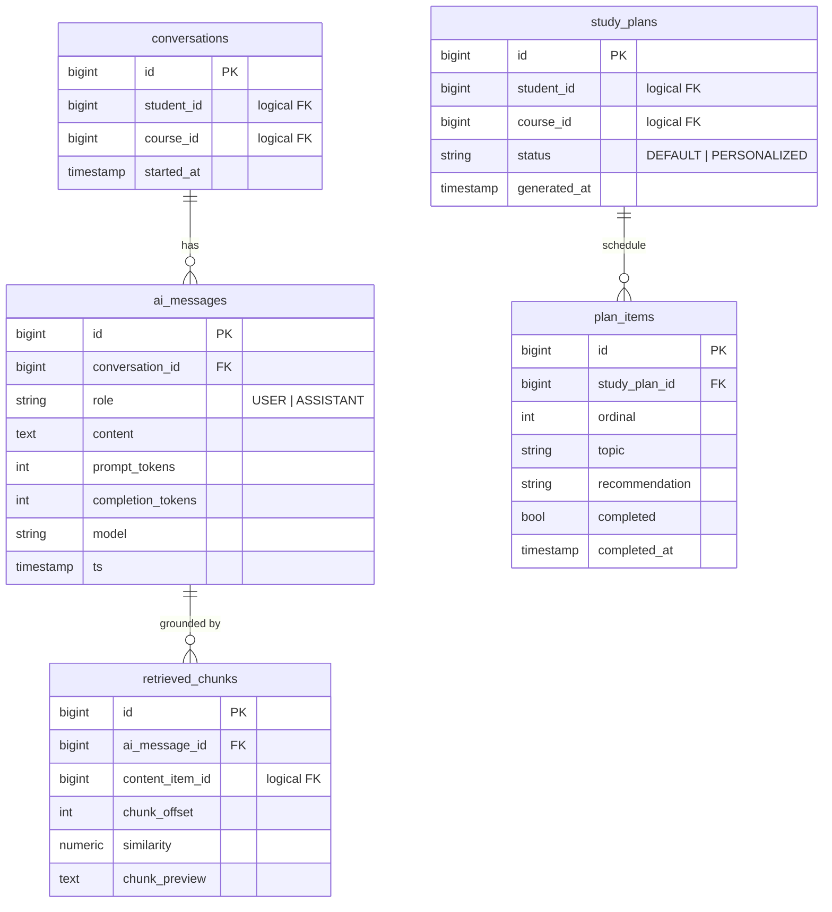

**Critical indexes:**
- `retrieved_chunks(ai_message_id)` + `retrieved_chunks(content_item_id)` — audit trail and CP-6 validation.
- `ai_messages(conversation_id, ts)` — chronological history.
- `study_plans(student_id, course_id, generated_at)` — most-recent-plan lookup.

Validates Req 17, Req 18, CP-6.

---


## 10. API Contract Strategy

- **Single source of truth.** OpenAPI 3.1 specs live in `caslearn-api-contracts`, one file per service (`auth.yaml`, `course.yaml`, `assessment.yaml`, `messaging.yaml`, `analytics.yaml`, `ai.yaml`, `gateway.yaml`). Specs are **semver-versioned**; breaking changes require a major bump and a review from the contracts CODEOWNER group (Req 22, Req 28).
- **Who publishes.** Each `*-service` CI job pushes its `openapi/*.yaml` to `caslearn-api-contracts` on merge to `main`. The contracts repo CI regenerates the Redocly static site.
- **Gateway enforcement (Req 4.1, CP-12).** The Gateway loads all specs at startup and validates every incoming request path, method, query, body, and response schema against the contract. Malformed requests are rejected with HTTP 400 before reaching any backend.
- **Service-side defence in depth.** Each service re-validates with Jakarta Bean Validation (`@Valid`, `@NotNull`, `@Size`, `@Pattern`). A request that passes the Gateway but violates service constraints still returns HTTP 400 with the standard error envelope.
- **Client generation.** `caslearn-web-ui` runs `openapi-typescript-codegen` against the contracts repo during `pnpm install` (post-install hook) and during CI. One generated TS client per service, consumed by one RTK Query API slice per service.
- **Versioning strategy.** Each service publishes `/v1/` paths. Minor versions add optional fields only. Major versions run side by side (`/v1/`, `/v2/`) for one sprint before removal.
- **Error envelope (shared).**

  ```json
  {
    "code": "ENROLLMENT_REQUIRED",
    "message": "Student is not enrolled in this course.",
    "requestId": "req_01HZX4B...",
    "details": []
  }
  ```

### 10.1 Representative Endpoints

| Service | Method + Path | Request | Success | Errors |
|---|---|---|---|---|
| auth | `POST /v1/auth/login` | `{email, password}` | `200 {accessToken, refreshToken, expiresIn}` | `401 INVALID_CREDENTIALS` (opaque), `423 ACCOUNT_LOCKED` |
| auth | `POST /v1/auth/refresh` | `{refreshToken}` | `200 {accessToken, refreshToken}` | `401 TOKEN_EXPIRED`, `401 TOKEN_REVOKED` |
| course | `GET /v1/courses/{id}/content` | — (JWT) | `200 [{id,title,moduleId,type,url,...}]` | `403 ENROLLMENT_REQUIRED`, `404 COURSE_NOT_FOUND` |
| course | `POST /v1/courses/{id}/content` | multipart file + metadata | `201 {id,...}` | `403 NOT_COURSE_OWNER`, `413 FILE_TOO_LARGE`, `415 UNSUPPORTED_MIME` |
| assessment | `POST /v1/quizzes/{id}/attempts/{attemptId}/submit` | `{answers:[{questionId,value}]}` | `200 {score,breakdown}` | `409 QUIZ_IN_PROGRESS`, `410 ATTEMPT_EXPIRED` |
| assessment | `GET /v1/students/me/grades?courseId=` | — | `200 [{courseId,assessmentId,score,max,released}]` | `403 OWNERSHIP_VIOLATION` |
| messaging | `POST /v1/courses/{id}/announcements` | `{subject, body}` | `201 {id}` | `403 NOT_COURSE_OWNER` |
| ai | `POST /v1/ai/ask` | `{courseId, question}` | `200 {answer, citations:[{contentItemId, chunkOffset}]}` | `403 ENROLLMENT_REQUIRED`, `429 RATE_LIMITED` |
| ai | `GET /v1/ai/plans?courseId=` | — | `200 {planId, items:[...]}` | `404 NO_PLAN_AVAILABLE` |

---

## 11. Request Lifecycle & Correlation

Every request picks up identifiers at the edge and carries them all the way to the database and back:

1. **Gateway.** Reads or generates:
   - `x-request-id` — if missing, Gateway generates a ULID.
   - W3C `traceparent` — if missing, Gateway starts a new trace (Req 25.4).
2. **Logging context.** Each service installs an MDC filter that puts `request_id`, `trace_id`, `span_id`, `user_id` (post-JWT), and `request_path` into the logging context before business logic runs.
3. **Structured log line format** (Logback JSON encoder):

   ```json
   {
     "ts":"2026-07-12T15:04:05.123Z",
     "level":"INFO",
     "service":"caslearn-course-service",
     "logger":"c.l.course.api.CourseController",
     "trace_id":"0af7651916cd43dd8448eb211c80319c",
     "span_id":"b7ad6b7169203331",
     "request_id":"01J1ABCXYZ...",
     "user_id":"42",
     "request_path":"GET /v1/courses/7/content",
     "message":"served content list"
   }
   ```
4. **Propagation.** Every outbound call (service-to-service via RestClient / WebClient) propagates `traceparent` and `x-request-id`. If a downstream fails to echo back `traceparent`, the caller completes the request normally and emits `trace_propagation_failure_total` (Req 25.4).
5. **Fail-closed on RBAC unavailability.** The RBAC engine is a local Spring bean that reads from in-process caches and, on miss, calls Auth Service. If Auth Service is unreachable **and** the ownership fact isn't cached, the service returns `503` with `code: RBAC_UNAVAILABLE` and emits `analytics_authz_unavailable_total` / `rbac_unavailable_total` (Req 13.4). No request ever defaults to "allow".
6. **Maintenance mode separation** (Req 3.6 vs Req 3.7). The audit writer distinguishes:
   - **Persistence failure** (DB unreachable, constraint violation, hash chain step fails): request rejected with 500, `audit_log_write_failure_total` increments.
   - **Intentionally disabled (admin maintenance flag)**: request proceeds, `audit_log_disabled_requests_total` increments. This flag is gated behind an admin-only endpoint and is itself audit-logged whenever flipped.

---

## 12. RBAC Design

Two enforcement layers (Req 2.2, Req 2.3). If layer 1 is breached by a future Istio bug, layer 2 still holds — and vice versa.

### 12.1 Layer 1 — Istio `AuthorizationPolicy`

Every backend service namespace applies a deny-all default, then a per-service allow list:

```yaml
# conceptual — lives in caslearn-platform-helm/charts/<service>/templates/authpolicy.yaml
apiVersion: security.istio.io/v1
kind: AuthorizationPolicy
metadata:
  name: course-service-authz
spec:
  selector:
    matchLabels: { app: caslearn-course-service }
  action: ALLOW
  rules:
    - from:
        - source:
            principals: ["cluster.local/ns/caslearn-gateway/sa/gateway-sa"]
            # AI needs authorized content set:
        - source:
            principals: ["cluster.local/ns/caslearn-ai/sa/ai-sa"]
      when:
        - key: request.auth.claims[role]
          values: ["ADMIN", "INSTRUCTOR", "STUDENT"]
```

### 12.2 Layer 2 — Spring Security

Three reusable annotations, each backed by a `MethodSecurityExpressionHandler`:

| Annotation | Checks |
|---|---|
| `@RequireRole({ADMIN, INSTRUCTOR})` | JWT role claim is in the list. |
| `@RequireCourseOwnership` | `request.courseId` resolves to a course whose `owner_instructor_id` equals the JWT subject. |
| `@RequireEnrollment` | `(request.courseId, JWT subject)` exists in `enrollments` with status `ACTIVE`, and course status is in `{PUBLISHED, ARCHIVED}`. Implements CP-1 at the method-level. |

**Role-field rejection filter** (Req 2.5, Req 2.6, CP-3). A servlet filter runs before any controller and inspects the request body, headers, and query string for a field literally named `role`. If found — **and** the path is not `PUT /v1/users/{id}/role` called by an admin — the request is rejected with HTTP 403 and `code: ROLE_ESCALATION_BLOCKED` emitted to the audit log, regardless of whether the submitted value matches the user's current role. The filter never reads the `role` claim from anywhere but the JWT.

**Information-leak-preserving 404** (Req 2.4). Spring Security's authorization-denied handler checks whether revealing existence of the resource to the caller would itself leak information (e.g., a student guessing course IDs). For those paths, the service returns 404, not 403. A decision table of `{role, resource_type} → {403, 404}` lives in `RbacResponseStrategy` so the policy is reviewable in one place.

---

## 13. AI / RAG Design

### 13.1 Ingestion Pipeline (asynchronous)

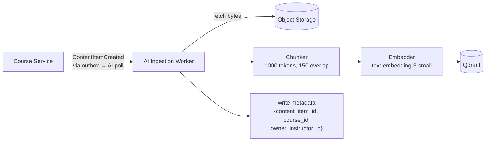

Each Qdrant point carries payload metadata `{content_item_id, course_id, owner_instructor_id}` so retrieval can filter on content_item_id without a separate join.

### 13.2 Retrieval + Answering (synchronous, per request)

1. `RetrievalAuthorizationFilter` calls Course Service `GET /internal/authorized-content-items?studentId=S&courseId=C` (`@RequireEnrollment` enforced there). Returns the set `A`.
2. Embed the student's question.
3. Query Qdrant: `search(vector, top_k=5, filter: content_item_id IN A)`. This is the concrete implementation of **Req 17.4** and **CP-6** — authorized items are never in the candidate set.
4. If `max(score) < 0.2`, short-circuit with the refusal response (Req 17.3).
5. Assemble prompt with a strict citation template:

   ```
   System: You are CasLearn OLMS's course-grounded assistant. Answer ONLY from the
   provided chunks. If a claim is not supported by a chunk, say so. Every claim
   must cite the chunk as [CIT:{content_item_id}#{chunk_offset}].

   Chunks:
   [CIT:123#2] <chunk text>
   [CIT:123#3] <chunk text>
   ...

   Question: <student's question>
   ```
6. Call the LLM via egress allow-list.
7. `CitationBuilder` parses `[CIT:id#offset]` markers and emits structured citations on the response.
8. Persist `{prompt, retrieved_chunks, response}` in `ai.conversations / ai_messages / retrieved_chunks` **and** emit an audit log entry of type `AI_ANSWER_GROUNDED` (Req 17.2).

### 13.3 Performance

- Target: p95 < 10 s for questions under 500 tokens (Req 17.5). Budget: 200 ms Course Service authz, 150 ms embed, 200 ms Qdrant, 7 s LLM, 500 ms assemble + audit, 2 s headroom.
- LLM client uses Resilience4j circuit breaker with a 12 s overall timeout.

### 13.4 Adaptive Study Planner (Req 18)

Inputs:
- Recent submissions + grades for `(student, course)` from Assessment Service.
- Course module order + content items from Course Service.

Algorithm (deterministic, no LLM needed):

```
plan_items = []
for each graded assessment in the last 30 days for the course:
  student_pct = score / max_score
  course_avg_pct = courseAverageFor(assessment)
  if student_pct < 0.7 * course_avg_pct:
      topic = inferTopic(assessment)     // from question tags / module linkage
      plan_items.push({topic, rationale: "below 70% of course avg"})
if plan_items empty and student has NO grades in course:
  plan_items = default plan from Course module order (Req 18.4)
sort by upcoming due date asc, then by module ordinal
```

This keeps the planner deterministic, testable, and cheap. LLM-generated narrative is an optional post-MVP enhancement.

---

## 14. Audit Log Chain Design

### 14.1 Table shape (per service)

```sql
CREATE TABLE audit_log (
  id           BIGINT AUTO_INCREMENT PRIMARY KEY,
  actor_id     BIGINT NOT NULL,
  actor_role   VARCHAR(16) NOT NULL,
  action       VARCHAR(64) NOT NULL,
  target_type  VARCHAR(32) NOT NULL,
  target_id    VARCHAR(64) NOT NULL,
  payload_json JSON NOT NULL,
  request_id   VARCHAR(32) NOT NULL,
  ts           TIMESTAMP(3) NOT NULL,
  prev_hash    CHAR(64) NOT NULL,   -- hex SHA-256
  entry_hash   CHAR(64) NOT NULL,
  INDEX idx_audit_ts (ts),
  INDEX idx_audit_actor (actor_id, ts),
  INDEX idx_audit_target (target_type, target_id, ts),
  INDEX idx_audit_chain (prev_hash, entry_hash)
);
```

### 14.2 Hash chain

- **Canonicalisation.** `payload_json` is serialised with sorted keys, UTF-8, no insignificant whitespace, before hashing.
- **Entry hash.** `entry_hash = HEX(SHA-256( canonical_payload_bytes || prev_hash_bytes ))`.
- **Seed.** The first row in each service's `audit_log` uses `prev_hash = 64 zero bytes`.
- **Write path.** `AuditChainWriter` takes a pessimistic row lock on the last audit row within the same transaction as the business mutation, computes `entry_hash`, and inserts. If any step fails (including the chain step), the enclosing request is rejected with HTTP 500 (Req 3.4, Req 3.6).

### 14.3 Verifier + alerting

- `AuditChainVerifierJob` runs nightly per service.
- Walks the table in `id` order, recomputes each `entry_hash`, compares.
- On first mismatch: logs at ERROR with the row id, increments `audit_chain_broken_total`, fires `AuditChainBroken` Alertmanager alert.
- Runbook: `caslearn-docs/runbooks/audit-chain-break.md`.

### 14.4 Signed export (Req 3.5)

Admin-only endpoint `GET /v1/audit/export?from=...&to=...`:

- Query filtered entries.
- Bundle as NDJSON.
- Sign with an export signing key (distinct from JWT key).
- Return `{file: .ndjson, signature: .sig, publicKey: .pub}` in a tarball.

### 14.5 Maintenance mode (Req 3.7)

`AuditMaintenanceFlag` is a singleton row in `auth.system_policies`. When set by an admin (which is itself audit-logged while the flag is still active on the other services' writers, since `auth` uses its own local writer), other services allow the triggering request to proceed and increment `audit_log_disabled_requests_total`. The dashboard panel for this metric has a baseline alert — any non-zero value in prod pages the on-call.

Validates Req 3, CP-5.

---

## 15. Observability Design

### 15.1 Metrics

- **Collector.** Prometheus scrapes `/actuator/prometheus` on every service via an Istio-sidecar-aware `ServiceMonitor`.
- **Baseline (Micrometer built-ins).** JVM, HTTP server, HTTP client, Hikari, Tomcat, process CPU, heap.
- **Domain metrics** — explicit from requirements:

  | Metric | Type | Emitted by | Validates |
  |---|---|---|---|
  | `audit_log_write_failure_total{service, action}` | counter | all services | Req 3.6 |
  | `audit_log_disabled_requests_total{service, action}` | counter | all services | Req 3.7 |
  | `trace_propagation_failure_total{caller, callee}` | counter | all services | Req 25.4 |
  | `analytics_authz_unavailable_total` | counter | analytics | Req 13.4 |
  | `rbac_unavailable_total{service}` | counter | all services | Req 13.4 (generalized) |
  | `audit_chain_broken_total{service}` | counter | verifier job | Req 3.3 / CP-5 |
  | `smoke_test_override_total` | counter | CI audit | Req 20.7 |
  | `istio_requests_total` | counter | Istio (built-in) | Req 24.4 |

### 15.2 Logs

- Logback JSON encoder → stdout → Promtail → Loki (Req 25.3).
- Required fields on every line: `ts, service, logger, level, trace_id, span_id, request_id, user_id?, request_path?, message`.
- PII is never logged (names, emails, grades, submission contents). Student `user_id` is fine; `display_name` is not (`security.md` PII minimization).

### 15.3 Traces

- Micrometer Tracing + OTLP exporter → Tempo.
- Spans for: HTTP server, HTTP client, JDBC, Istio passthrough (free). Custom span `ai.retrieve` wraps Qdrant search; custom span `audit.chain.write` wraps the chain insert.

### 15.4 Dashboards

| Dashboard | Panels |
|---|---|
| `<service>` (one per service) | RED (rate / errors / duration p50/p95/p99), request count by endpoint, 5xx by endpoint, DB pool usage, heap, GC, Kafka-like lag (n/a MVP), service-specific domain metrics |
| `Admin Overview` (Req 8.2) | Per-service request rate, error rate, p95 latency, CPU, memory; active user count (5-min unique `user_id` from gateway); audit metrics row; RBAC failure row |

All dashboards load 15-minute default window within 5 s (Req 8.3) — enforced by keeping queries to single-metric `rate(... [5m])` with recording rules where needed.

### 15.5 Alerts

| Alert name | Expression (sketch) | Fires on |
|---|---|---|
| `HighErrorRate` | `sum(rate(http_server_requests_seconds_count{status=~"5.."}[5m])) by (service) / sum(rate(http_server_requests_seconds_count[5m])) by (service) > 0.05` | Req 25.6 |
| `HighLatencyP95` | `histogram_quantile(0.95, sum by (service,le) (rate(http_server_requests_seconds_bucket[5m]))) > 1` | Req 25.7, separate from HighErrorRate |
| `AuditChainBroken` | `increase(audit_chain_broken_total[15m]) > 0` | Req 3.3 / CP-5 |
| `TraceGapDetected` | `increase(trace_propagation_failure_total[15m]) > 0` | Req 25.4 |
| `AnalyticsAuthzUnavailable` | `increase(analytics_authz_unavailable_total[10m]) > 0` | Req 13.4 |

---

## 16. Day-0 Smoke Test Design

Target: **< 10 minutes on 16 GiB / 4 CPU** (Req 20.4), one command, reproducible in CI (Req 20.6).

### 16.1 Script outline — `caslearn-docs/scripts/day0-up.sh`

```
#!/usr/bin/env bash
# CasLearn OLMS — Day-0 bring-up and smoke test.
set -euo pipefail
STEP=""
trap 'echo "FAIL at step: $STEP" >&2; exit 1' ERR

STEP="prereqs"       ; check_prereqs        # docker, kind, kubectl, helm, gh, jq, curl, jdk 21, node 20, pnpm
STEP="kind cluster"  ; kind create cluster --config kind.yaml
STEP="istio"         ; helm install istio-base ... ; helm install istiod ...
STEP="cert-manager"  ; helm install cert-manager ...
STEP="argocd"        ; helm install argocd ...
STEP="kps"           ; helm install kube-prometheus-stack ...
STEP="loki"          ; helm install loki ...
STEP="tempo"         ; helm install tempo ...
STEP="minio"         ; helm install minio ...
STEP="mysql-op"      ; helm install mysql-operator ...
STEP="qdrant"        ; helm install qdrant ...
STEP="caslearn-app"     ; kubectl apply -f umbrella/caslearn-platform-argo-local.yaml
STEP="wait pods"     ; kubectl wait --for=condition=ready pods --all -A --timeout=600s
STEP="smoke"         ; ./smoke.sh
echo "PASS  — logs in /tmp/caslearn-day0/"
```

### 16.2 Prerequisite checks

| Tool | Min version | Source |
|---|---|---|
| Docker | 24+ | Docker Desktop or docker-ce |
| kind | 0.22+ | `brew install kind` |
| kubectl | 1.28+ | `brew install kubectl` |
| helm | 3.14+ | `brew install helm` |
| gh | 2.40+ | `brew install gh` |
| JDK 21 | Temurin 21 | `brew install --cask temurin@21` |
| Node | 20 LTS | nvm |
| pnpm | 9+ | `corepack enable pnpm` |

Missing tools abort with the single failed step name (Req 20.5).

### 16.3 Smoke suite — `smoke.sh`

1. `GET /healthz` on every backend service (200 expected).
2. `POST /v1/auth/login` with seeded admin (`admin@demo.caslearn.local` / env-supplied password) → assert JWT returned.
3. `GET /v1/courses` with JWT → UI → Gateway → Course Service → MySQL → JSON array. Verify at least one seeded course is present.
4. `GET /` on Web UI → assert SPA shell loads and renders "Welcome, Admin" after login. Playwright headless (already in toolchain).
5. Each step appends `[PASS] step-name` or `[FAIL] step-name  log=/tmp/caslearn-day0/<step>.log` and continues only on PASS.

### 16.4 CI integration

- GitHub Actions workflow `smoke.yaml` lives in both `caslearn-platform-helm` and `caslearn-docs`. Blocks merge on failure (Req 20.6).
- Workflow steps: checkout, cache kind images, run `day0-up.sh`, upload `/tmp/caslearn-day0/**` as artifact on failure.

### 16.5 Override path (Req 20.7)

- Uses CODEOWNERS team `@caslearn/release-override`.
- PR comment of form `override: smoke-test REASON=<text>` with a signed commit signature check.
- Workflow detects the comment, skips the blocking step, and emits an audit log entry of type `SMOKE_TEST_OVERRIDE` into the cluster's audit log via the Jenkins post-build step (increments `smoke_test_override_total`).

---

## 17. Repository Bootstrap Design

All fifteen MVP repos are created from the common template in a single scripted run, with identical branch-protection rules and scaffolding (Req 19).

### 17.1 `caslearn-docs/repos.yaml`

```yaml
org: caslearn-learn
default_template: caslearn-learn/caslearn-repo-template
codeowners_team: "@caslearn/platform"
jenkins_webhook: https://jenkins.caslearn.internal/github-webhook/

repos:
  - name: caslearn-web-ui
    suffix: -ui
    template: caslearn-learn/caslearn-ui-template
    description: CasLearn OLMS — React/TypeScript SPA
  - name: caslearn-auth-service
    suffix: -service
    template: caslearn-learn/caslearn-service-template
    description: CasLearn OLMS — authentication, users, RBAC, audit
  - name: caslearn-course-service
    suffix: -service
    template: caslearn-learn/caslearn-service-template
    description: CasLearn OLMS — courses, enrollments, content
  - name: caslearn-assessment-service
    suffix: -service
    template: caslearn-learn/caslearn-service-template
    description: CasLearn OLMS — quizzes, assignments, grading
  - name: caslearn-messaging-service
    suffix: -service
    template: caslearn-learn/caslearn-service-template
    description: CasLearn OLMS — messages, announcements, notifications
  - name: caslearn-analytics-service
    suffix: -service
    template: caslearn-learn/caslearn-service-template
    description: CasLearn OLMS — reports and dashboards
  - name: caslearn-ai-service
    suffix: -service
    template: caslearn-learn/caslearn-service-template
    description: CasLearn OLMS — RAG assistant and study planner
  - name: caslearn-gateway-service
    suffix: -service
    template: caslearn-learn/caslearn-service-template
    description: CasLearn OLMS — API Gateway / BFF
  - name: caslearn-platform-tf
    suffix: -tf
    template: caslearn-learn/caslearn-tf-template
    description: CasLearn OLMS — shared Terraform modules
  - name: caslearn-env-tf
    suffix: -tf
    template: caslearn-learn/caslearn-tf-template
    description: CasLearn OLMS — environment compositions
  - name: caslearn-jenkins-build
    suffix: -build
    template: caslearn-learn/caslearn-build-template
    description: CasLearn OLMS — Jenkins shared library
  - name: caslearn-platform-helm
    suffix: -helm
    template: caslearn-learn/caslearn-helm-template
    description: CasLearn OLMS — Helm charts
  - name: caslearn-platform-argo
    suffix: -argo
    template: caslearn-learn/caslearn-argo-template
    description: CasLearn OLMS — ArgoCD app-of-apps manifests
  - name: caslearn-api-contracts
    suffix: -contracts
    template: caslearn-learn/caslearn-contracts-template
    description: CasLearn OLMS — shared OpenAPI specs
  - name: caslearn-docs
    suffix: -docs
    template: caslearn-learn/caslearn-docs-template
    description: CasLearn OLMS — architecture, runbooks, onboarding, ADRs
```

### 17.2 `caslearn-docs/scripts/bootstrap-repos.sh` — behaviour

1. Parse `repos.yaml` (yq / python).
2. For each entry:
   - `gh repo create <org>/<name> --template <template> --private --description "<desc>"`
   - Clone the newly created repo.
   - Seed the 14-section README template with the repo name and description filled in (the rest stay as explicit `TODO` markers so CI's README check catches them).
   - Add `CODEOWNERS` pointing at the configured team.
   - Initial commit: `chore: scaffold from repo template` signed with the bot's key.
   - Push to `main`.
3. Apply branch protection via `gh api`:
   ```
   PATCH /repos/<org>/<name>/branches/main/protection
   {
     "required_status_checks": { "strict": true, "contexts": ["ci/jenkins"] },
     "enforce_admins": true,
     "required_pull_request_reviews": { "required_approving_review_count": 1 },
     "restrictions": null
   }
   ```
4. Enable Dependabot alerts + secret scanning via `gh api`.
5. Register the Jenkins webhook: `POST /repos/<org>/<name>/hooks` with the common webhook URL.
6. Print a summary table:

   ```
   Repo                         Clone URL                                             Webhook
   caslearn-web-ui                 git@github.com:caslearn-learn/caslearn-web-ui.git           OK
   caslearn-auth-service           git@github.com:caslearn-learn/caslearn-auth-service.git     OK
   ...
   ```
7. Exit non-zero if any repo failed so the whole operation is retriable / idempotent (the script skips repos that already exist).

### 17.3 Suffix-enforcement CI stage (Req 19.4)

A single reusable Jenkins stage runs first in every pipeline:

- Read the repo name.
- Match against the allowed suffix regex `-(ui|service|tf|build|helm|argo|contracts|docs)$`.
- On failure, print `REPO_NAMING_VIOLATION: <repo>` with its own status context (`ci/repo-naming`) so the violation is a distinct reason and never hidden by other failures.

---

## 18. Scalability & Capacity Plan

**MVP target:** 5,000 concurrent users across 500 courses. JMeter sustained test at 500 concurrent users must hold p95 ≤ 300 ms on common reads (Req 26.2, Req 26.6). Design headroom = 10×.

### 18.1 Replica starting counts

| Service | Start replicas | HPA min/max | HPA trigger |
|---|---|---|---|
| caslearn-web-ui (Nginx) | 2 | 2 / 6 | CPU 70% |
| caslearn-gateway-service | 3 | 3 / 12 | CPU 70%, `http_server_requests` RPS custom metric |
| caslearn-auth-service | 2 | 2 / 6 | CPU 70% |
| caslearn-course-service | 3 | 3 / 10 | CPU 70%, RPS |
| caslearn-assessment-service | 3 | 3 / 10 | CPU 70%, RPS |
| caslearn-messaging-service | 2 | 2 / 6 | CPU 70% |
| caslearn-analytics-service | 2 | 2 / 4 | CPU 70% |
| caslearn-ai-service | 2 | 2 / 6 | CPU 70%, RPS; separate node pool |
| Qdrant | 3 (StatefulSet) | fixed | — |

### 18.2 HikariCP sizing

Formula used (classic): `pool = ((core_count * 2) + effective_spindle_count)` as an upper bound per pod, and sized so that **total pod connections ≤ 75% of DB `max_connections`**.

MySQL `max_connections = 300` per cluster (RDS default tuned). Starting per-pod pool:

| Service | Per-pod pool | At max HPA | DB sessions used | Notes |
|---|---|---|---|---|
| auth | 10 | 6 × 10 = 60 | 20% | |
| course | 15 | 10 × 15 = 150 | 50% | hottest reader |
| assessment | 12 | 10 × 12 = 120 | 40% | grade writes |
| messaging | 8 | 6 × 8 = 48 | 16% | |
| analytics | 6 | 4 × 6 = 24 | 8% | reads + ETL |
| ai | 8 | 6 × 8 = 48 | 16% | |
| gateway | 0 | — | — | no DB |

If the sum at max HPA exceeds 75% of `max_connections`, scale MySQL up before adding replicas — documented in `caslearn-docs/runbooks/scaling.md`.

### 18.3 Redis cache usage

- **Session store.** Refresh-token metadata, rate-limit buckets (per JWT subject, sliding 1-minute window).
- **Hot reads.**
  - Course metadata (`course:{id}` → JSON, TTL 60 s).
  - User role cache (`role:{userId}` → role, TTL 5 min) — invalidated on role change via pub/sub.
  - Enrollment membership (`enroll:{studentId}:{courseId}` → bool, TTL 5 min) — invalidated on enroll/drop.
- **Eviction.** `maxmemory-policy allkeys-lru`.

### 18.4 CDN

Out of scope for MVP — served directly from Istio ingress. Recorded in `caslearn-docs/post-mvp-backlog.md`.

---

## 19. Error Handling & Resilience

### 19.1 Circuit breakers

Every cross-service call uses Resilience4j `CircuitBreaker` + `TimeLimiter` + `Retry` (retry only on idempotent GETs):

- Rolling 100-call window, 50% failure threshold → open.
- 30 s open → half-open with 5 probe calls.
- `Retry`: 3 attempts, exponential backoff 50 → 200 → 800 ms with jitter.

### 19.2 Timeout hierarchy (strict, enforced)

| Hop | Timeout |
|---|---|
| Browser → Gateway | 10 s (ingress) |
| Gateway → Service | 8 s |
| Service → Service | 5 s |
| Service → DB | 2 s query; 30 s transaction max |
| AI → LLM | 12 s (exception; Req 17.5 allows) |

Each lower layer's timeout must be strictly less than the one above to avoid stacking retries.

### 19.3 Bulkheads

Per-downstream thread pools (via virtual threads + semaphore): a misbehaving LLM endpoint cannot exhaust the pool used for Course Service calls.

### 19.4 Retry policy

- GETs to other services: retry safe.
- POST/PUT/PATCH/DELETE: **never** retried automatically by the HTTP layer. The caller owns retry semantics with an idempotency key where needed.

### 19.5 Standard error envelope

All services emit:

```json
{
  "code": "ENROLLMENT_REQUIRED",
  "message": "Student is not enrolled in this course.",
  "requestId": "req_01HZX4B...",
  "details": []
}
```

- `code` is a service-owned enumeration; documented in each service's OpenAPI spec.
- `message` is human-readable and **never** contains PII.
- `requestId` always present — links to logs + traces.

### 19.6 Fail-closed on RBAC unavailability

- If RBAC can't be evaluated (Auth Service unreachable, cache stale and fetch failed), the service responds 503 with `code: RBAC_UNAVAILABLE`, increments `rbac_unavailable_total`, and the Analytics Service specifically increments `analytics_authz_unavailable_total` (Req 13.4).

---

## 20. Frontend Architecture

### 20.1 Stack (locked by `tech.md`)

- Vite + React 18 + TypeScript strict.
- Redux Toolkit + **RTK Query**, one API slice per backend, generated from OpenAPI.
- React Router v6 with persona-split lazy routes: `/admin/*`, `/instructor/*`, `/student/*`.
- **Design system:** Material UI (MUI) — selected for its strong a11y primitives and data-dense components (DataGrid, Stepper, Autocomplete). Tailwind CSS used as a utility layer for one-offs (spacing, layout overrides). Choice confirmed in S0; ADR drafted in `caslearn-docs/adr/ADR-0001-mui-vs-chakra.md` if Chakra is preferred later.
- **Design tokens** in `src/styles/tokens.ts`:
  - Color palette (primary CasLearn indigo + role-tinted secondaries for Admin/Instructor/Student).
  - Spacing scale (4-px base).
  - Typography: Inter (400/500/600/700).
  - Motion: `duration.short=150ms`, `duration.medium=250ms`, `easing.standard=cubic-bezier(0.4,0,0.2,1)`.
- Forms: React Hook Form + Zod resolver; shared Zod schemas imported from the generated OpenAPI types where practical.

### 20.2 Layout

- Desktop: left sidebar nav + topbar. Sidebar collapsible; topbar holds user menu, notifications, global search.
- Mobile (<640 px): bottom-tab nav + hamburger for admin/instructor sections.

### 20.3 Data-fetching patterns

- RTK Query handles caching, polling, re-fetch on focus.
- Optimistic updates on: grade entry, enrollment, marking notification read, planner item completion.
- Pessimistic (server-confirmed) on: login, submission, content upload.

### 20.4 Persona routing

```
/                           →  redirect to role-specific home
/admin/overview             →  Admin Overview dashboard
/admin/users                →  user management
/admin/audit-log            →  audit log browser
/instructor/courses         →  my courses
/instructor/courses/:id     →  course authoring
/instructor/grading         →  grading queue
/student/courses            →  my enrollments
/student/courses/:id        →  course view
/student/assistant/:cid     →  AI assistant in course context
/student/planner/:cid       →  adaptive study planner
```

Each persona's routes load as a separate bundle (`React.lazy` + `Suspense` boundary).

### 20.5 Testing

- Vitest + React Testing Library for component/unit.
- Playwright E2E with three seeded personas (`admin@demo`, `instructor@demo`, `student@demo`). One E2E flow per persona is gated on CI.
- fast-check property tests for client-side invariants (form validation, grade-display formatting).
- axe-core in CI; each persona journey must pass (Req 26.5). Any violation fails the build.

### 20.6 Observability from the browser

- Structured fetch wrapper adds `x-request-id` header per request (UUID). Logged locally for support.
- Web Vitals (LCP, INP, CLS) sent to Gateway `POST /v1/telemetry/web-vitals`, forwarded to Prometheus via the `prometheus-aggregation-gateway` pattern (post-MVP a full RUM stack).

---

## 21. Correctness Property → Implementation Mapping

Each correctness property from `requirements.md` is owned by a specific service and verified with the listed test class. All 12 properties are wired into CI; jqwik runs as part of the Maven `verify` phase, fast-check runs under Vitest.

| CP ID | Property (short) | Owner Service / Module | Test Class | Generator Strategy | Kind |
|-------|------------------|------------------------|------------|--------------------|------|
| CP-1  | Enrollment gate on course materials | `caslearn-course-service` / `ContentAccessAuthorizer` | `com.caslearn.course.property.EnrollmentGateProperty` (jqwik) | Pair `(Student, Course)` with varied `enrollment_status ∈ {ACTIVE,DROPPED,COMPLETED,none}` × `course_status ∈ {DRAFT,PUBLISHED,ARCHIVED}`. Expect read allowed iff ACTIVE ∧ status ∈ {PUBLISHED, ARCHIVED}. | PBT |
| CP-2  | Grade confidentiality | `caslearn-assessment-service` / `GradeReadController` | `com.caslearn.assessment.property.GradeConfidentialityProperty` (jqwik) | Arbitrary set of students, each owning a random grade set; drive random `GET /grades` calls by `s2 ≠ s1`; expect never to see `s1`'s records. | PBT |
| CP-3  | No role escalation | `caslearn-auth-service` + `caslearn-gateway-service` | `com.caslearn.auth.property.NoRoleEscalationProperty` (jqwik) | Fuzz the `role` field across body/query/header and token claim across every public endpoint; expect post-request user role = pre-request role unless the request is `PATCH /users/{id}/role` by an Admin. | PBT |
| CP-4  | Deterministic assessment scoring | `caslearn-assessment-service` / `Grader` | `com.caslearn.assessment.property.DeterministicScoringProperty` (jqwik) | Generate `(Submission, Rubric)`; evaluate `score(x,r)` N times and compare; also generate canonically-equivalent answer pairs (e.g. whitespace normalization in short-answer) and expect equal scores. | PBT |
| CP-5  | Audit log append-only + tamper-evident | Shared `caslearn-audit` library (used by all services) | `com.caslearn.audit.property.ChainIntegrityProperty` (jqwik, stateful) | Generate sequences of writes interleaved with simulated mutation/deletion attempts; verify `entry_hash_n = SHA-256(payload_n || prev_hash_n)` and reject any verifier run that observes an out-of-order or missing entry. | PBT |
| CP-6  | AI retrieval authorization | `caslearn-ai-service` / `RetrievalFilter` | `com.caslearn.ai.property.RetrievalAuthProperty` (jqwik, **mocked LLM**) | Generate `(student, question, authorized_set, full_set)` with `authorized_set ⊆ full_set`; run retrieval pipeline; assert that the `content_item_ids` used to ground the response are a subset of `authorized_set`. LLM stub is deterministic — returns chunk identifiers it was fed. | PBT |
| CP-7  | Quiz scoring round-trip preservation | `caslearn-assessment-service` / `GradeBookRepository` | `com.caslearn.assessment.property.GradeRoundTripProperty` (jqwik) | Generate `(Quiz, AnswerSet)`; score → persist → reload; assert same score and per-question breakdown. Covers JSON serialization, column truncation, numeric precision. | PBT |
| CP-8  | Enrollment count invariant under concurrency | `caslearn-course-service` / `EnrollmentService` | `com.caslearn.course.property.ConcurrentEnrollmentProperty` (jqwik stateful, Testcontainers MySQL) | Generate interleaved enroll/drop ops from N virtual students; after execution assert `count(active) = issued − drops`. Exercises row-level locks and transaction isolation. | PBT (stateful) |
| CP-9  | Notification delivery idempotence | `caslearn-messaging-service` / `NotificationDispatcher` | `com.caslearn.messaging.property.NotificationIdempotenceProperty` (jqwik) | Generate notification event `e` and replay count `r ∈ [1,10]`; assert exactly one in-app delivery and at most one email per recipient after all retries. | PBT |
| CP-10 | Helm chart portability | `caslearn-platform-helm` | `test/helm/portability_test.sh` + golden files | Not a generator — render each chart with `onprem` and `aws` values, diff the set of `kind: ...` resources; expect equality. | Integration (golden-file) |
| CP-11 | JWT validation completeness | `caslearn-gateway-service` / `JwtFilter` | `com.caslearn.gateway.property.JwtValidationProperty` (jqwik) | Generate `(header, payload, signing_key)` tuples mutating each field independently (signature, exp, iss, role claim); assert forward iff valid signature ∧ exp > now ∧ iss = expected. | PBT |
| CP-12 | OpenAPI contract conformance | All `*-service` repos (contract tests) | `com.caslearn.<svc>.contract.OpenApiConformanceTest` (JUnit + `swagger-request-validator`) | Not PBT — representative request/response pairs for every endpoint tested against the published `caslearn-api-contracts` spec. Contract drift → CI fails. | Integration |

### 21.1 Enforcement in CI

- Backend PRs run `mvn -Dgroups=property verify` before merge; any shrunk counterexample fails the build with the seed printed for reproduction.
- Frontend PRs run `pnpm test:property` which triggers fast-check suites.
- CP-10 runs in the `caslearn-platform-helm` pipeline on every PR.
- CP-12 runs in each service's pipeline *and* in a cross-repo contract job that re-verifies every live service against the latest contracts spec nightly.

### 21.2 Counterexample handling

- Failing property tests attach the shrunk input to the Jenkins build as an artifact (`target/property-failures/<test>-<seed>.json`).
- The test classes are annotated with `@Property(seed = "...")` placeholders so a counterexample can be pinned and replayed until fixed.

---

## 22. Risk & Mitigation

Top technical risks identified in `delivery.md` and how the design addresses each.

| Risk | Mitigation in this design |
|------|---------------------------|
| **Scope creep erodes July 31 deadline** | MVP repo list (15) and requirement list (30) are fixed. New items route to `caslearn-docs/post-mvp-backlog.md`. The sprint plan in `delivery.md` budgets S6 entirely for hardening, not features. |
| **AI cost + latency surprises** | AI_Service is the only component that calls the LLM (Sec 13). All other services call AI_Service internally. CI uses a deterministic LLM stub for PBT (CP-6) so property runs are free. Prod usage is metered with a daily spend alert. Retrieval threshold 0.2 short-circuits for off-topic questions (Req 17.3). |
| **RBAC complexity causes leaks** | Two-layer defense (Istio + Spring Security) in Sec 12. CP-1, CP-2, CP-3 are enforced via PBT from Sprint 1. The role claim is read only from the JWT — never from request bodies. Audit log records every denial and every cross-student grade access (Req 27.4). |
| **Istio learning curve delays platform work** | Sec 5 and Sec 6/7 pin exact versions and topology. A shared installer script is part of `day0-up.sh` (Sec 16) so every developer's mesh is identical. Runbook `caslearn-docs/runbooks/istio-troubleshooting.md` is part of the S0 deliverable. Fallback: if Istio blocks progress past Sprint 1, a documented plan allows falling back to NetworkPolicies + service-account-based authn while retaining the interface; ADR will be filed. |
| **Timeline compression** | S0 Day-0 smoke test (Sec 16) gates every subsequent sprint, so integration debt can't pile up. Re-plan gate at end of S3 (week 6) per `delivery.md` — if burn-down is off, cut AI_Service (S5) to a minimal non-RAG assistant with fixed disclaimers and defer RAG to post-MVP. |
| **On-prem ↔ EKS drift** | CP-10 property (Helm chart portability) is enforced on every PR to `caslearn-platform-helm` (Sec 9 values files + Sec 6/7 topologies). The chart's `pre-install` validation hook rejects cross-environment override attempts (Req 23.2, Req 23.3). |
| **Audit log tampering or chain break** | Hash-chained entries (Sec 14), daily verifier job, `AuditChainBroken` alert (Sec 15), append-only constraint enforced at both app and DB layer. Signed exports (Req 3.5). Maintenance-mode metric path (Req 3.7) keeps operations observable without weakening the invariant. |
| **FERPA violation via analytics or AI** | Analytics fail-closed on RBAC unavailability (Req 13.4 → `rbac_unavailable_total`). AI retrieval restricted to authorized content_item_ids per request (CP-6). Instructor-to-instructor and student-to-student data never co-mingles in read models (Sec 9 Analytics). Right-to-delete design in Sec 14 preserves audit integrity while removing PII. |
| **Dependency / supply-chain compromise** | Trivy + Dependabot in every pipeline, Gitleaks blocks secret commits, base images pinned by digest, container image signing planned post-MVP (cosign), `caslearn-api-contracts` is the only inter-service interface — direct service-to-service DB access is forbidden. |
| **JMeter load-test noise in CI** | Nightly-only execution with sustained 500-concurrent-user profile (Req 26.6); PR pipelines use a 50-user smoke profile that completes in < 3 minutes. |
| **Developer onboarding stalls** | `day0-up.sh` (Sec 16) + `bootstrap-repos.sh` (Sec 17) + 14-section README template (documentation.md) + onboarding.md walkthrough. Target: merged PR within first week (Req 28.5). |

### 22.1 What the design explicitly defers

- Signed container images (cosign) → post-MVP.
- Advanced RUM / front-end observability → post-MVP; basic Web Vitals only for MVP.
- Ambient-mode Istio → remains on sidecar mode for MVP; ambient evaluated for cost reduction post-MVP.
- Multi-tenant data partitioning → single-tenant assumption baked in; `tenant_id` column reserved on core tables so a schema-preserving migration is possible later.

---

## 23. Open Questions for Design Sign-Off

These must be resolved in Sprint 0 before implementation of the touched component begins. Each has an owner and a target sprint day.

| # | Question | Owner | Target | Default if not decided by target |
|---|----------|-------|--------|-----------------------------------|
| OQ-1 | **Email provider**: MailHog for dev is clear, but staging/prod — Postfix on-prem, Amazon SES on AWS, or a single abstraction? | Platform Eng | S0 Day 3 | Postfix on-prem, SES on AWS; notification service speaks SMTP to both. |
| OQ-2 | **OIDC issuer config**: are we using the Auth_Service as our own issuer, or introducing Keycloak / Dex now to leave room for SSO later? | Tech Lead | S0 Day 4 | Auth_Service is the sole issuer for MVP; Keycloak evaluated post-MVP for SSO. ADR-0002 drafted either way. |
| OQ-3 | **LLM vendor & rate limits**: OpenAI? Azure OpenAI? self-hosted vLLM? Rate limits drive AI_Service back-pressure design. | AI Lead | S0 Day 5 | OpenAI-compatible (so the interface is pluggable); use `gpt-4o-mini` class equivalent; budget alert at $500/month for dev. |
| OQ-4 | **MUI vs Chakra**: steering says MUI "or Chakra, pick one." Lock this before any UI PRs merge. | UX Lead + FE | S0 Day 2 | **MUI** (data-density + a11y edge). ADR-0001 filed. |
| OQ-5 | **Istio: ambient vs sidecar mode**? Ambient saves memory but is newer. | Platform Eng | S0 Day 5 | **Sidecar** for MVP (stability); revisit post-MVP. |
| OQ-6 | **Vector store: FAISS embedded vs Qdrant in-cluster for prod**? FAISS is simpler, Qdrant scales. | AI Lead | S0 Day 4 | **Qdrant in-cluster** for parity on-prem and EKS; FAISS only for local dev within AI_Service unit tests. |
| OQ-7 | **MySQL deployment mode on-prem**: Percona Operator or plain StatefulSet with mysql-router? | Platform Eng | S0 Day 6 | Percona Operator — backups, restores, and failover already solved. |
| OQ-8 | **Frontend artifact destination**: JFrog Artifactory npm or GitHub Packages? `tech.md` lists both. | Platform Eng | S0 Day 3 | **JFrog Artifactory** — single registry for Java + npm + Docker simplifies auth and retention policies. |
| OQ-9 | **Branch-protection review count**: one approver or two for `main`? | Tech Lead | S0 Day 2 | One approver; two for `caslearn-env-tf` and `caslearn-platform-argo` (blast radius). |
| OQ-10 | **On-call rotation setup**: PagerDuty (paid) vs OpsGenie free tier vs Grafana OnCall (OSS)? | Platform Eng | S0 Day 7 | **Grafana OnCall** — stays within the OSS observability principle from `product.md`. |
| OQ-11 | **Data retention policy for AI conversation history**: how long do we keep prompt/chunks/response per Req 17.2? | Product + Security | S0 Day 5 | 180 days for student conversations; 30 days for aggregated analytics; documented in the student data-export contract. |
| OQ-12 | **Seeded demo data set**: how many courses, instructors, students for the Day-0 smoke test and demos? | PM + QA | S0 Day 4 | 3 courses, 2 instructors, 15 students, 1 admin, 1 published quiz, 1 draft assignment. Generated by `caslearn-docs/scripts/seed-demo.sh`. |

### 23.1 Design sign-off criteria

Sign-off is achieved when:

1. Each OQ above is answered in writing (ADR or design addendum).
2. A 30-minute walkthrough of this document is completed with the full team in attendance.
3. The repo bootstrap script (Sec 17) is executed end-to-end in a sandbox GitHub org.
4. The Day-0 smoke-test script (Sec 16) is executed end-to-end on the sign-off engineer's laptop.

Once those four boxes are ticked, this design is frozen; changes go through ADRs in `caslearn-docs/adr/`.

---

## 24. Requirements Traceability Matrix (summary)

A quick cross-reference so reviewers can spot-check that every requirement is addressed somewhere in the design. The per-section "Validates Req X" callouts inside each section above are the primary source; this table is a reviewer's index.

| Req | Design section(s) |
|---|---|
| Req 1 (Auth + JWT) | §1, §2.3, §4.1, §12, §14.2 |
| Req 2 (RBAC) | §1, §11, §12 |
| Req 3 (Audit log) | §1, §14, §15.1 |
| Req 4 (Input validation + rate limit) | §1, §10, §11 |
| Req 5 (Encryption + secrets) | §1, §5, §6, §7 |
| Req 6 (User mgmt) | §2.3, §9.1 |
| Req 7 (Course admin) | §9.2 |
| Req 8 (Admin policies + observability) | §8, §15.4 |
| Req 9 (Course authoring) | §2.2, §9.2 |
| Req 10 (Assessment authoring) | §2.4, §9.3 |
| Req 11 (Grading workflows) | §2.4, §9.3, §21 (CP-4/CP-7) |
| Req 12 (Instructor comms) | §9.4 |
| Req 13 (Instructor analytics) | §9.5, §11, §15 |
| Req 14 (Enrollment + content) | §4.2, §9.2, §21 (CP-1/CP-8) |
| Req 15 (Assignment/quiz submission) | §9.3, §21 (CP-2) |
| Req 16 (Student messaging + notifs) | §9.4, §21 (CP-9) |
| Req 17 (AI assistant) | §2.5, §4.3, §13, §21 (CP-6) |
| Req 18 (Adaptive planner) | §13.4 |
| Req 19 (Repo naming + bootstrap) | §17 |
| Req 20 (Day-0 smoke test) | §16 |
| Req 21 (Terraform + Atlantis) | §8 |
| Req 22 (Jenkins + ArgoCD) | §8 |
| Req 23 (Helm portability) | §6, §7, §21 (CP-10) |
| Req 24 (Istio mesh + authz) | §5, §12.1 |
| Req 25 (Observability) | §15 |
| Req 26 (NFR perf/availability/a11y) | §18, §19, §20 |
| Req 27 (FERPA) | §1, §14.4, §15.2 |
| Req 28 (Documentation standards) | §10, §16, §17 |
| Req 29 (Testing strategy) | §21 |
| Req 30 (MVP scope boundaries) | §1, §22 (scope-creep row) |

---

**End of design.** Ready for S0 sign-off. Next step: review the already-drafted `tasks.md` to break this design into sprintable units with property-based testing gates and explicit repo-by-repo ownership.

| CP   | Property                                           | Owning Service / Module                                    | Test Class                                                                        | Generator Strategy                                                                                                                                                             | Kind              |
|------|----------------------------------------------------|------------------------------------------------------------|-----------------------------------------------------------------------------------|--------------------------------------------------------------------------------------------------------------------------------------------------------------------------------|-------------------|
| CP-1 | Enrollment gate on course materials                | `caslearn-course-service` — `ContentAccessPolicy`             | `com.caslearn.course.property.ContentAccessPropertyTest`                        | `@ForAll` Student, Course (status ∈ {DRAFT, PUBLISHED, ARCHIVED}), Enrollment (status ∈ {ACTIVE, DROPPED, COMPLETED, NONE}); assert read succeeds ⇔ ACTIVE ∧ status ≠ DRAFT    | PBT (jqwik)       |
| CP-2 | Grade confidentiality                              | `caslearn-assessment-service` — `GradeQueryService`           | `com.caslearn.assessment.property.GradeConfidentialityPropertyTest`             | Generate two Students with disjoint ownerships, then assert every grade API path for s1 returns 403/404 when called by s2                                                      | PBT (jqwik)       |
| CP-3 | No role escalation                                 | `caslearn-auth-service` + `caslearn-gateway-service`             | `com.caslearn.auth.property.RoleEscalationPropertyTest`                         | Fuzz request body/header/query with a `role` field across a random endpoint in the OpenAPI spec; assert post-request user role is unchanged unless admin-initiated role change | PBT (jqwik)       |
| CP-4 | Deterministic assessment scoring                   | `caslearn-assessment-service` — `DeterministicScorer`          | `com.caslearn.assessment.property.ScoringDeterminismPropertyTest`               | `@ForAll` Submission and Rubric; assert `score(x,r) == score(x,r)` and that canonically-equal answer sets score equal                                                          | PBT (jqwik)       |
| CP-5 | Audit log append-only and tamper-evident           | Shared audit library in every `*-service`                  | `com.caslearn.common.audit.property.AuditChainPropertyTest`                     | Generate sequences of events `[e1..en]`; assert `entry_hash(ei) == SHA-256(canonical(ei.payload) ∥ prev_hash(ei-1))` for every i; no mutation API path exists                   | PBT (jqwik)       |
| CP-6 | AI retrieval authorization                         | `caslearn-ai-service` — `AuthorizedRetrievalFilter`           | `com.caslearn.ai.property.RetrievalAuthorizationPropertyTest`                   | `@ForAll` Student, question text, authorized Content_Item set A, unauthorized set U; mock LLM; assert retrieved set ⊆ A and ∩ U = ∅                                            | PBT (jqwik, mock LLM) |
| CP-7 | Quiz scoring round-trip preservation               | `caslearn-assessment-service` — `GradeBookRepository`         | `com.caslearn.assessment.property.GradeBookRoundTripPropertyTest`               | `@ForAll` (Quiz, answer set); persist via repo; reload; assert total and per-question breakdown equal                                                                          | PBT (jqwik + Testcontainers MySQL) |
| CP-8 | Enrollment count invariant under concurrency       | `caslearn-course-service` — `EnrollmentService`               | `com.caslearn.course.property.EnrollmentConcurrencyPropertyTest`                | Stateful PBT: model as `(issued, dropped)` counters; generate interleavings of enroll/drop; assert `count(ACTIVE) = issued - drops`                                            | Stateful PBT (jqwik) |
| CP-9 | Notification delivery idempotence                  | `caslearn-messaging-service` — `NotificationDispatcher`       | `com.caslearn.messaging.property.NotificationIdempotencePropertyTest`           | `@ForAll` notification event; dispatch N≥2 times; assert exactly one in-app delivery and ≤1 email per recipient, keyed by `(event_id, recipient_id)`                           | PBT (jqwik)       |
| CP-10| Helm chart portability                             | `caslearn-platform-helm` (CI)                                 | `chart-portability.test.yaml` invoked by Jenkins                                  | `helm template --values values.onprem.yaml` and `--values values.aws.yaml`; diff rendered resource kinds & counts; assert equal                                                | Integration       |
| CP-11| JWT validation completeness                        | `caslearn-gateway-service` — `JwtAuthenticationFilter`        | `com.caslearn.gateway.property.JwtValidationPropertyTest`                       | `@ForAll` token with fields (signature, exp, iss, alg) varied; assert forwarded ⇔ valid signature ∧ `exp>now` ∧ `iss=expected`                                                 | PBT (jqwik)       |
| CP-12| OpenAPI contract conformance                       | All `*-service` repos (CI)                                 | Contract test stage in Jenkins pipeline using `schemathesis` / REST Assured       | For each endpoint in the service's OpenAPI spec, generate example-driven requests; assert response schema matches                                                              | Integration / contract |

**Coverage gate.** Req 29.3 sets a 70% line-coverage floor per service; Req 29.4 requires property-based tests per correctness property. Interim policy (per the auto-resolution of Req 29.4 from the requirements analysis): builds may pass without every PBT implemented yet, but every CP must have at least a stub test marked `@Disabled("CP-N pending — TARGET SPRINT S_")` and the responsible sprint owner documented. No CP may remain stubbed after the sprint that ships its owning feature.

**Shrinking strategy.** jqwik's default shrinking is enabled globally. For generators returning large object graphs (CP-1, CP-8), we supply `@Provide` methods that build minimal Student/Course/Enrollment tuples first so shrunk counterexamples remain legible.

---

## 22. Risk & Mitigation

The risk register in `.kiro/steering/delivery.md` is the weekly tracker. Below are the **technical** risks the design itself has to absorb — every row names the design element that does the absorbing.

| Risk                                                         | Likelihood | Impact | Design mitigation                                                                                                                                                                                                      |
|--------------------------------------------------------------|:----------:|:------:|------------------------------------------------------------------------------------------------------------------------------------------------------------------------------------------------------------------------|
| RBAC complexity (two layers, three roles, ownership rules)   |   High     |  High  | Dual enforcement (§12) + `@RequireRole` / `@RequireCourseOwnership` / `@RequireEnrollment` annotations + CP-1/CP-2/CP-3 PBTs running from the first sprint that introduces each resource. Negative authz tests required for PR merge on any endpoint touching course/assessment/messaging data. |
| AI cost and latency variance from external LLM               |  Medium    |  High  | LLM call is behind the Retrieval Authorization Filter (§13). All CI tests use a **mocked LLM** (`TestLlmClient`). Token-budget metric `ai_llm_tokens_total` exported; Alertmanager rule `AiBudgetBurn` fires at 80% of the daily budget. Default model is configurable; we start on the cheapest capable tier and escalate per course size. |
| Istio learning curve / misconfigured AuthorizationPolicy silently allowing traffic | Medium | High | Fail-closed posture (§5, Req 24.3). Every service ships with both a `PeerAuthentication STRICT` and an `AuthorizationPolicy DENY` default; allowlists are additive. A Jenkins stage runs `istioctl analyze` on every PR to `caslearn-platform-helm`. Runbook `caslearn-docs/runbooks/istio-troubleshooting.md` written in S0. |
| On-prem ↔ AWS drift over time                                |  Medium    | Medium | Single Helm chart path (Req 23). `pre-install` hook rejects mismatched storage values (Req 23.2/23.3). CP-10 integration test on every chart PR. Two env compositions (`on-prem` / `aws-eks`) in `caslearn-env-tf` exercised nightly via smoke pipeline. |
| Audit chain corruption under concurrent writes               |  Medium    |  High  | Per-service single-writer pattern for `audit_log` (serialised inserts within a transaction). `prev_hash` computed inside the same TX that writes the row. Verifier job daily; `AuditChainBroken` is a page-level alert. Regression covered by CP-5 PBT. |
| Scope creep pushing past July 31, 2026                       |   High     |  High  | Fixed 15-repo MVP list (structure.md). Requirement 30 boundary is a Jenkins gate: any PR adding a scope marked `post-mvp` to a non-docs repo fails. New asks land in `caslearn-docs/post-mvp-backlog.md`. |
| File-upload abuse (MIME spoofing, zip bombs, oversized)      |  Medium    | Medium | MIME allow-list + size limit per endpoint enforced **before** streaming to object storage (Req 9.3). Gateway rejects bodies >25 MiB except on whitelisted upload endpoints (Req 4.3). Follow-up ticket to add ClamAV in-cluster post-MVP. |
| FERPA / data privacy incident                                |   Low      |  High  | Every non-self access to student grades/submissions audit-logged (Req 27.4). Export-in-72 h and delete-on-request flows designed (Req 27.2/27.3). Logs scrubbed of PII at the Logback encoder layer. |
| Vector-store poisoning via malicious course content           |   Low      | Medium | Ingestion pipeline (§13.1) runs as `caslearn-ai-service`-owned ServiceAccount only. Chunks tagged with `owner_instructor_id`; retrieval honours authorization — an instructor cannot surface another course's material to their students. Retrieval similarity threshold 0.2 prevents nonsense chunks from dominating. |
| Timeline compression if any sprint slips                     |  Medium    |  High  | S0 "Day-0 smoke test" lands the entire skeleton green in week 0, so feature sprints start from a deployable platform. Mid-project replan checkpoint at end of S3 per `delivery.md`. If S5 (AI) is at risk, AI Service ships with the planner only and the assistant degrades to a citation-only search over course materials. |
| Jenkins / ArgoCD single points of failure                    |   Low      | Medium | Jenkins agents stateless; master uses HA backup nightly to object storage. ArgoCD configured with `repoServer` HA (2 replicas). If ArgoCD is down, `kubectl apply` of the last committed Helm release is the documented break-glass path (runbook). |
| Browser support for niche features (DataGrid, Vitals)        |   Low      |  Low   | MUI DataGrid degrades to simple table view on unsupported combinations. Browserslist pinned to "last 2 versions of evergreen" in `package.json`; CI Playwright matrix covers Chromium, Firefox, WebKit. |

---

## 23. Open Questions for Design Sign-Off (S0)

These are the decisions that must be closed in the first two weeks (S0) so they do not block feature sprints. Each has an owner and a target day.

| # | Question                                                                                           | Owner (role)        | Target | Default if unanswered                                                                 |
|---|----------------------------------------------------------------------------------------------------|---------------------|--------|---------------------------------------------------------------------------------------|
| 1 | Email provider for MVP — dev vs prod                                                                | DevOps              | S0-D2  | **MailHog** in dev; **Postfix relay on-prem** / **Amazon SES** on AWS for prod        |
| 2 | OIDC issuer URL and JWKS rotation cadence                                                           | Backend Tech Lead   | S0-D3  | Issuer `https://auth.caslearn.local` (on-prem) / `https://auth.caslearn.io` (AWS); keys rotate every 90 days, 24 h overlap window |
| 3 | LLM vendor and rate-limit policy                                                                    | AI Engineer + PM    | S0-D4  | OpenAI-compatible endpoint; `gpt-4o-mini`-class model for MVP; 200 req/min platform-wide with per-course soft cap; budget alert at 80% daily spend |
| 4 | Component-library final freeze (MUI vs Chakra)                                                      | Frontend Lead       | S0-D3  | **Material UI** per §20.1; ADR-0001 filed either way                                  |
| 5 | Istio ambient vs sidecar mode                                                                       | Platform Engineer   | S0-D5  | **Sidecar mode** (proven, better docs); revisit post-MVP                              |
| 6 | Frontend artifact registry (JFrog npm vs GitHub Packages)                                           | DevOps              | S0-D3  | **JFrog Artifactory npm repo** for consistency with Maven + Docker artifacts          |
| 7 | Vector store — FAISS embedded vs Qdrant in-cluster for local dev                                    | AI Engineer         | S0-D4  | **Qdrant in-cluster** everywhere (uniformity); FAISS only inside unit tests           |
| 8 | MySQL operator on-prem — Percona vs Oracle MySQL Operator                                           | Platform Engineer   | S0-D4  | **Percona Operator for MySQL** (permissive license, better HA story)                   |
| 9 | Secret-management tool on-prem — Sealed Secrets vs Vault OSS                                        | Platform Engineer   | S0-D5  | **Sealed Secrets** for MVP (simplest), migrate to Vault post-MVP if needed            |
| 10| Nightly JMeter load-test budget and target dataset                                                  | QA Engineer         | S0-D7  | 500 concurrent users, 30-minute steady-state, seeded with 10,000 students / 500 courses |
| 11| Session store TTL (Redis) vs JWT-only stateless auth                                                | Backend Tech Lead   | S0-D4  | **JWT-only for access**; Redis holds refresh-token rotation bookkeeping + short-lived idempotency keys (not sessions) |
| 12| Image signing (cosign) — MVP or post-MVP?                                                           | Platform Engineer   | S0-D6  | **Post-MVP** (tracked in `caslearn-docs/post-mvp-backlog.md`); SHA-pinned digests + Trivy scan in MVP |

**Sign-off procedure.** At the end of S0, each row either has a confirmed value in `caslearn-docs/adr/ADR-0002-design-signoff.md` or its default locks in and the ADR records that default with a date. No design question leaves S0 open.

---

## Appendix: Requirements → Design Traceability

Every numbered requirement from `requirements.md` must surface in this design. This index is the reviewer's cross-check.

| Req(s)       | Primary Design Section(s)                     |
|--------------|-----------------------------------------------|
| 1            | §1, §2.2, §4.1, §10, §11, §14                 |
| 2, CP-3      | §1, §5, §12, §21                              |
| 3, CP-5      | §1, §14, §15, §21, §22                        |
| 4            | §1, §5, §10, §11, §19                         |
| 5            | §1, §5, §6, §7                                |
| 6, 7, 8      | §2.2, §9, §15                                 |
| 9            | §9, §13.1, §22                                |
| 10, 11, CP-4, CP-7 | §9, §13, §21                            |
| 12, 16, CP-9 | §9, §21                                        |
| 13           | §9, §15, §19                                  |
| 14, CP-1, CP-8 | §9, §12, §21                                |
| 15, CP-2     | §9, §21                                        |
| 17, CP-6     | §1, §13, §21, §22                             |
| 18           | §13                                            |
| 19           | §17                                            |
| 20           | §16                                            |
| 21           | §7, §8                                         |
| 22           | §8                                             |
| 23, CP-10    | §6, §7, §21                                   |
| 24           | §5, §12                                        |
| 25           | §15                                            |
| 26           | §18, §19, §20                                 |
| 27           | §9, §14, §22                                  |
| 28           | this document + `caslearn-docs` (per steering)   |
| 29, CP-11, CP-12 | §8, §10, §20.5, §21                       |
| 30           | §1 + scope gate in §22                        |

---

*End of design.*
## 21. Correctness Property → Implementation Mapping

Every correctness property from `requirements.md` is paired with a concrete test home and generator strategy. PBT uses **jqwik** in Java services and **fast-check** on the frontend. Integration-style checks use Testcontainers (backend) or Playwright (frontend).

| CP | Property | Owner service / module | Test class | Generator strategy | Type |
|---|---|---|---|---|---|
| CP-1 | Enrollment gate on content reads | `caslearn-course-service` — `ContentReadAuthorizationTest` | `com.caslearn.course.property.ContentReadAuthorizationProperties` (jqwik) | Arbitrary `(student, course, enrollment_status, course_status)` tuples; assert read succeeds iff `status=ACTIVE` AND course ∈ `{PUBLISHED, ARCHIVED}` | PBT |
| CP-2 | Grade confidentiality across students | `caslearn-assessment-service` — `GradeReadConfidentialityProperties` | jqwik | Generate student pairs `(s1, s2)` with overlapping/non-overlapping enrollments; assert every read path for `s2` excludes `s1`'s grades | PBT |
| CP-3 | No role escalation via any field | `caslearn-gateway-service` + `caslearn-auth-service` — `RoleEscalationProperties` | jqwik | Fuzz `role` in body / header / query / JWT claim across every endpoint; assert post-request user role unchanged except on admin role-change path | PBT |
| CP-4 | Deterministic assessment scoring | `caslearn-assessment-service` — `DeterministicScoringProperties` | jqwik | Arbitrary `(quiz, rubric, answer_set)`; assert `score(x, r) = score(x, r)` and canonical-equivalent answer sets score equally | PBT |
| CP-5 | Audit log append-only + tamper-evident | All services — `AuditChainProperties` (shared `audit-lib`) | jqwik stateful model | Generate sequences of audit writes + attempted tampers; verify the `entry_hash = SHA-256(payload \|\| prev_hash)` invariant and that no API mutates/deletes past entries | PBT (stateful) |
| CP-6 | AI retrieval authorization | `caslearn-ai-service` — `RetrievalAuthorizationProperties` | jqwik with mocked Qdrant + LLM | Generate `(student, question, authorized_content_set)`; assert every retrieved chunk's `content_item_id ∈ authorized_set` | PBT |
| CP-7 | Quiz scoring round-trip preservation | `caslearn-assessment-service` — `GradeBookRoundTripProperties` | jqwik + Testcontainers MySQL | Generate `(quiz, answers, score)` triples; write → read → assert equality including per-question breakdown | PBT |
| CP-8 | Enrollment count invariant under concurrency | `caslearn-course-service` — `EnrollmentConcurrencyProperties` | jqwik stateful model with concurrent executors | Interleave enroll/drop ops; assert `count(ACTIVE) = enrollments_issued − drops` | PBT (stateful + concurrency) |
| CP-9 | Notification delivery idempotence | `caslearn-messaging-service` — `NotificationIdempotenceProperties` | jqwik | Generate notification events + duplicates; assert exactly-one in-app + ≤1 email per recipient per idempotency key | PBT |
| CP-10 | Helm chart portability | `caslearn-platform-helm` — `helm-portability-test.sh` | `helm template --values onprem.yaml` vs `--values aws.yaml`; compare resource kind + count sets | Single comparison — no randomization needed | Integration (not PBT) |
| CP-11 | JWT validation completeness | `caslearn-gateway-service` — `JwtValidationProperties` | jqwik | Arbitrary JWT token fields (signature variants, iss, exp, alg, kid, claims); assert forward iff all validity conditions met | PBT |
| CP-12 | OpenAPI contract conformance | All `*-service` repos — Spring REST Docs + OpenAPI 3.1 validator | Per-endpoint representative requests in `*ContractTest` | Fixed example set per endpoint | Integration (not PBT) |

**Coverage enforcement.** The Jenkins pipeline runs the full PBT suite on every PR. A PR that modifies code owning a CP without running its corresponding test class fails the build via a pre-merge lint check in `caslearn-jenkins-build`.

**Generator reuse.** Shared jqwik `@Provide` methods live in an internal `caslearn-test-support` library (published to JFrog Maven repo) so generators for `User`, `Course`, `Enrollment`, `Quiz`, `AuditEntry` stay consistent across services.

---

## 22. Risk & Mitigation

Top technical risks for the MVP and how this design defuses each.

| Risk | Likelihood | Impact | Mitigation baked into the design |
|---|---|---|---|
| **RBAC complexity** — authz bugs are the #1 LMS vulnerability | High | Severe (FERPA, reputation) | Two enforcement layers (Istio + Spring), PBT for CP-1/CP-2/CP-3/CP-11 from S1, role-field rejection filter, fail-closed on RBAC unavailability, annotation library (`@RequireRole`, `@RequireCourseOwnership`, `@RequireEnrollment`) to keep controller code declarative |
| **Istio learning curve** | Medium | Delays S0 delivery | Day-0 script installs Istio with a known-good Helm values set; `caslearn-docs/runbooks/istio-troubleshooting.md` drafted in S0; pair rotation on first AuthorizationPolicy changes |
| **AI cost / latency spikes** | Medium | Runway burn, SLO misses | Mocked LLM in all CI tests (zero cost); egress allow-list prevents rogue calls; per-student per-day token quotas; Resilience4j circuit breaker on LLM client; p95 budget table in §13.3 |
| **Data consistency across services without a broker** | Medium | Eventual-consistency bugs | Per-service MySQL + local outbox tables for async events; polled drainer (every 30 s) for `notification_outbox` and `content_item_created_outbox`; idempotency keys everywhere; Kafka deferred post-MVP with an ADR pre-drafted |
| **On-prem / AWS drift** | Medium | Broken portability promise | Helm `pre-install` hook enforces storage match (Req 23.2/3); CP-10 integration test asserts resource-kind parity; ADR required for any divergence |
| **Audit log chain break (silent corruption)** | Low | Severe (compliance) | SHA-256 hash chain, nightly verifier, `AuditChainBroken` alert, signed export, dedicated runbook, maintenance-mode metric distinct from failure metric |
| **Scope creep** | High | Deadline slip | Fixed 15-repo MVP list, new asks go to `caslearn-docs/post-mvp-backlog.md`, S0 delivery gate (Day-0 smoke test in CI) before any feature work begins |
| **Timeline compression** | High | Feature cuts | S0 buys velocity (every later sprint starts with working infra); S3 is the checkpoint to re-plan if slipping; S6 is hardening, not new features |
| **Student PII leaks through AI** | Medium | Severe (FERPA) | Authorization filter runs **before** retrieval (not after); audit every prompt/chunks/response; citations required; refusal threshold 0.2; PII scrub on logs |
| **First-time Istio + ArgoCD integration** | Medium | S0 extension | Day-0 script installs both at known versions and verifies sync; ArgoCD apps use `prune: true` and `selfHeal: true` only in dev |

---

## 23. Open Questions for Design Sign-Off

These need to close by end of S0 so they don't block downstream sprints. Each owner is tentative; adjust in the S0 kickoff.

| # | Question | Recommendation | Owner | Decision due |
|---|---|---|---|---|
| Q1 | Email provider for MVP | MailHog in local dev; Postfix relay on-prem; Amazon SES on AWS EKS — all via the same `SMTP_HOST/PORT/USER/PASS` env | DevOps | End of S0 |
| Q2 | OIDC issuer configuration | Use Auth Service's own issuer URL for MVP (`https://auth.<env>.caslearn.local/issuer`), signed by a rotating RSA-2048 keypair stored via Sealed Secrets | Backend lead | End of S0 |
| Q3 | LLM vendor + rate-limit policy | OpenAI-compatible endpoint pointing at Ollama (local dev) or Groq/OpenAI (staging/prod); per-user 30 msgs/hour, per-course 2 k msgs/day; review at S3 | AI owner | End of S0 |
| Q4 | MUI vs Chakra final freeze | Go MUI; Chakra reconsideration post-MVP only if accessibility or theming pain shows up | Frontend lead | End of S0 |
| Q5 | Istio ambient vs sidecar mode | Sidecar mode for MVP (better docs, more runbooks); ambient evaluated post-MVP when it's more mature on on-prem k3s | DevOps | End of S0 |
| Q6 | Vector store: FAISS vs Qdrant in prod | Qdrant in all envs for a single code path; FAISS only as an in-process fallback if Qdrant is unreachable in a degraded mode | AI owner | End of S1 |
| Q7 | Artifact registry for frontend npm | JFrog Artifactory npm repo (single pane with Java + Docker) rather than GitHub Packages; ADR-0002 drafts the choice | DevOps | End of S0 |
| Q8 | MySQL flavor on-prem | MySQL 8 via Percona/MySQL Operator; 3-node InnoDB cluster; `caslearn-platform-tf/modules/mysql` encapsulates both on-prem and RDS variants | Backend lead | End of S0 |
| Q9 | Backup + DR target | Velero + restic to an off-site S3-compatible bucket (e.g., Backblaze B2 for cost); RPO 24 h, RTO 4 h for MVP | DevOps | End of S0 |
| Q10 | PBT seed policy for flaky-test investigation | Deterministic seeds per test class committed in `test-seeds.yml`; verifier job replays seeds on failure | QA lead | End of S1 |

---

## 24. Requirements Traceability Matrix (summary)

A quick cross-reference so reviewers can spot-check that every requirement is addressed somewhere in the design. (This is not exhaustive — the per-section "Validates" callouts are the primary source.)

| Req | Design section(s) |
|---|---|
| Req 1 (Auth + JWT) | §1, §2.3, §4.1, §12, §14.2 |
| Req 2 (RBAC) | §1, §11, §12 |
| Req 3 (Audit log) | §1, §14, §15.1 |
| Req 4 (Input validation + rate limit) | §1, §10, §11 |
| Req 5 (Encryption + secrets) | §1, §5, §6, §7 |
| Req 6 (User mgmt) | §2.3, §9.1 |
| Req 7 (Course admin) | §9.2 |
| Req 8 (Admin policies + observability) | §8, §15.4 |
| Req 9 (Course authoring) | §2.2, §9.2 |
| Req 10 (Assessment authoring) | §2.4, §9.3 |
| Req 11 (Grading workflows) | §2.4, §13.4, §9.3, §21 (CP-4/CP-7) |
| Req 12 (Instructor comms) | §9.4 |
| Req 13 (Instructor analytics) | §9.5, §11, §19.6 |
| Req 14 (Enrollment + content) | §4.2, §9.2, §21 (CP-1/CP-8) |
| Req 15 (Assignment/quiz submission) | §9.3, §21 (CP-2) |
| Req 16 (Student messaging + notifs) | §9.4, §21 (CP-9) |
| Req 17 (AI assistant) | §2.5, §4.3, §13, §21 (CP-6) |
| Req 18 (Adaptive planner) | §13.4 |
| Req 19 (Repo naming + bootstrap) | §17 |
| Req 20 (Day-0 smoke test) | §16 |
| Req 21 (Terraform + Atlantis) | §8 |
| Req 22 (Jenkins + ArgoCD) | §8 |
| Req 23 (Helm portability) | §6, §7, §21 (CP-10) |
| Req 24 (Istio mesh + authz) | §5, §12.1 |
| Req 25 (Observability) | §15 |
| Req 26 (NFR perf/availability/a11y) | §18, §20.5, §19.2 |
| Req 27 (FERPA) | §1, §14.4, §15.2 |
| Req 28 (Documentation standards) | §10, §16, §17 |
| Req 29 (Testing strategy) | §21 |
| Req 30 (MVP scope boundaries) | §1, §22 (scope-creep row) |

---

**End of design.** Ready for S0 sign-off. Next step: generate `tasks.md` to break this design into sprintable units with property-based testing gates and explicit repo-by-repo ownership.
